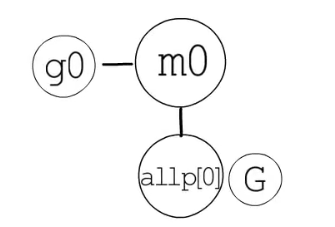

- [参考B站幼麟实验室](#参考b站幼麟实验室)
  - [字符串底层表示](#字符串底层表示)
  - [new与make的区别](#new与make的区别)
  - [hash与map](#hash与map)
  - [结构体与内存对齐](#结构体与内存对齐)
  - [函数](#函数)
    - [函数值 闭包 funcval](#函数值-闭包-funcval)
    - [方法](#方法)
  - [defer panic recover](#defer-panic-recover)
  - [类型系统](#类型系统)
  - [接口 interface](#接口-interface)
  - [反射](#反射)
  - [GMP GPM](#gmp-gpm)
    - [goroutine](#goroutine)
    - [g0 m0](#g0-m0)
  - [I/O多路复用](#io多路复用)
  - [垃圾回收 Garbage Collection](#垃圾回收-garbage-collection)
    - [只考虑单核的理论](#只考虑单核的理论)
  - [mutex](#mutex)
  - [channel](#channel)
    - [select](#select)
  - [内存分配](#内存分配)
    - [堆内存分配](#堆内存分配)
  - [内存程序各类区域](#内存程序各类区域)
    - [数据段 （全局区 静态区+常量区）](#数据段-全局区-静态区常量区)
    - [代码段](#代码段)
    - [堆](#堆)
    - [栈](#栈)

# 参考B站幼麟实验室

## 字符串底层表示

字符串变量首先是一个`指针`，一般分配在栈上，可逃逸到堆上，指向其字符串内容的起始地址，指针下一个区域会保存其字符串`字节数`作为结尾标识，字符串内容是存储在堆上的（不一定）


## new与make的区别

1. new返回指针，而make返回值
2. make只能用于slice、chan、map这几个类型，new用于创建值类型
3. make会进行**初始化**（指slice的指针会指向实际内存分配区域），**如果make([]int, 0)，data指针会指向一个空数组`[0]int`，而不是nil，**new不会，只会**返回零值对象**，如new([]string)返回指向零值slice的指针，其中**slice的data指针为nil，len和cap为0，与var s []int声明类似**

```go
ps := new([]string)
*ps = append(*ps, "element") # append的时候会进行初始化
```

new 函数分配内存，make 函数初始化；

new(T) ：为类型T分配一块内存，并返回指向这块内存地址的指针，它适用于值类型如数组和结构体；

make(T) ：初始化内置的数据结构，返回一个类型为 T 的空值，它只适用于3种内建的引用类型：slice、map 和 channel；

new 获取的是存储指定变量内存地址的一个变量，对于变量内部结构并不会执行相应的初始化操作

## hash与map

hash存储原理：

存储键值对时，会将`key`进行散列函数处理，使用`取模法`或者`与运算`，再决定该存放到`桶`的哪个位置

存放时会同时存放键值对，发生冲突时有两种方法：`开放地址法`和`拉链法`，两种方法在冲突时会比较`key`值来判断寻找正确的存放位置
开发地址法：直接存放在后续空白空间中
拉链法：在冲突位置链接出一个新桶存储，类似于链表

hash表会根据`负载因子`进行扩容，可以进行`渐进式扩容`，即记录旧桶位置和迁移进度，每一次读写时进行迁移

map底层结构：

map是一个指针，指向结构体`hmap`，hmap包含count键值对数目、B桶长度、新桶和旧桶的指针等

map指向的桶结构为`bmap`

## 结构体与内存对齐

结构体本身不会格外存储什么，相当于把内部字段集合在一起存放而已
结构体的各字段存放时会进行内存对齐，所以结构体所占空间大于各字段大小，且各字段可能不连续

## 函数

函数在内存中以栈帧形式存放
栈帧内容：调用函数的返回地址、该函数栈基、局部变量、该函数调用函数的返回值和入参，最后是栈顶指针，该函数返回地址

go语言支持多返回值，将返回值放在栈中而不是寄存器中，因为寄存器大小有限


被调用函数`入参`（拷贝）和被调用函数`返回值`空间是在调用函数栈帧中，且先分配空间给返回值，再存放入参
函数的传入参数和返回值，入栈顺序都是由右至左，依次压入栈中
调用函数会将变量拷贝到参数存放区域，然后调用该函数，所以在被调用函数中修改参数不会影响原有变量，除非是指针

### 函数值 闭包 funcval

函数值`function value`实际是一个指针，即`var f func()`的变量f为指针，为局部变量存放在`栈`上，指向`runtime.funcval`结构体，该结构体只有一个指针`fn`指向闭包函数代码
`闭包`会分配该结构体到`堆`上，旁边还存有`捕获变量`，即该闭包使用外部函数的变量会保存一份到堆上，因为内存逃逸
每个栈上的函数值都会对应一个堆上的结构体，捕获变量也不同

闭包函数捕获变量会根据情况编译器处理不同，for循环中定义闭包会导致捕获变量为指向变量的指针，所以最后调用闭包时只会拿到最后一次的值（go1.21更改）

### 方法

方法本质是语法糖，方法接收者会被作为第一参数传入，方法就是普通的函数

方法表达式`A.GetName()`和函数值一样，方法变量`a.GetName()`本质上也和函数值一样，不过有捕获列表存捕获变量，方法表达式没有
方法变量等价于`A.GetName(a)`

## defer panic recover

defer的函数会在函数返回值赋值后执行，匿名返回值和有名返回值情况区别在匿名返回值不能在defer中被改变了，而有名返回值可以

多个defer执行顺序LIFO，因为goroutine的`*_defer`结构体是链表形式链接起来的，头插法

panic也是链表`*_panic`头插法

分类总结
1. 有defer有panic, defer中没有recover且没有panic。
此种情况panic没有嵌套，defer可以正常结束，唯一的一个panic执行完defer链表，就会打印panic信息。
1. 有defer有panic, defer中有panic，但是没有recover。
出现panic嵌套，defer无法正常结束，此时，后面的panic会把前面的panic标记为aborted
1. 有defer有panic, defer中有recover，但是没有panic嵌套
已标记为recover的panic会被从panic链表中移除。不会在打印panic信息时输出该panic信息
1. 有defer有panic, defer中同时有recover, panic。
此时，recover中会被标记，后面的panic会将该panic标记为aborted。由于defer不能正常结束，所以被标记为recovered的panic仍然不能被移除。

## 类型系统

类型元数据存储在`runtime._type`结构体中

## 接口 interface

interface{}空接口结构体为`runtime.eface`，有`_type *_type`和`data unsafe.Pointer`，分别为动态类型和动态值
当接口被赋值时，动态类型指向变量类型元数据，动态值指向变量值
其中类型元数据中可以找到`方法元数据数组`

非空接口结构体为`runtime.iface`，有`tab *itab`和`data unsafe.Pointer`，其中`*itab`包含`*_type`，同时保存了接口的方法元数据数组

## 反射

反射无非就是通过类型系统和接口来获取和修改变量，详细见视频

```go
a := "old"
t := reflect.TypeOf(a)
v := reflect.ValueOf(&a)
v = v.Elem()
v.SetString("new")

fmt.Println(t, a, v)
```

## GMP GPM

代码段程序入口会先检查，然后创建`main goroutine`执行入口`runtime.main`，然后才是`main.main`

协程对应的数据结构是`runtime.g`，线程对应的是`runtime.m`
全局变量`g0`对应的是`主协程`（主协程创建了main goroutine），分配到数据段，`m0`对应的是主线程，也分配到数据段
m0和g0互相拥有指向彼此的指针

逻辑处理器对应的是`runtime.p`，引入p之后不需要对m加锁从全局队列获取g了，因为p有一个本地队列，保存g，m会从对应的p中获取g

除此之外还有全局变量`runtime.schedt`保存空闲的p、空闲的m、全局队列等，当p的本地队列满了之后，g会保存到全局队列中
m会先从对应p本地队列获取g，没有时再去全局队列获取g，如果还是没有会去其他p本地队列获取



`GOMAXPROCS`决定创建多少个p

`time.Sleep`会调用gopark使得goroutine状态从运行到阻塞

### goroutine

协程是什么？
协程可以看作线程的执行体，一个线程可以有多个协程，所以在线程中会保存执行体的栈基栈顶指针、执行入口、执行现场等，便于切换

`go hello(name)`不会在该栈帧中像调用普通函数一样加入hello的参数，因为底层是调用的`newproc`函数，入参为siz和fn的指针指向hello的funcval

goroutine的抢占、调度、创建等过程就不写了

### g0 m0

g 一般分为三种，分别是：

执行用户任务的叫做 g。
执行 runtime.main 的 main goroutine。
**执行调度任务的叫 g0**。
g0 比较特殊，每一个 m 都只有一个 g0（仅此只有一个 g0），且每个 m 都只会绑定一个 g0。在 g0 的赋值上也是通过汇编赋值的，其余后续所创建的都是常规的 g。

从多个方面来看：

数据结构：g0 和其他创建的 g 在数据结构上是一样的，但是存在栈的差别。在 g0 上的栈分配的是系统栈，在 Linux 上栈大小默认固定 8MB，不能扩缩容。而常规的 g 起始只有 2KB，可扩容。
运行状态：g0 和常规的 g 不一样，没有那么多种运行状态，也不会被调度程序抢占，调度本身就是在 g0 上运行的。
变量声明：g0 和常规 g，g0 的定义就是 var g0 g，没什么特别之处。


m0 是 Go Runtime 所创建的第一个系统线程，一个 Go 进程只有一个 m0，也叫`主线程`。

从多个方面来看：

数据结构：m0 和其他创建的 m 没有任何区别。
创建过程：m0 是进程在启动时应该汇编直接复制给 m0 的，其他后续的 m 则都是 Go Runtime 内自行创建的。
变量声明：m0 和常规 m 一样，m0 的定义就是 var m0 m，没什么特别之处。

## I/O多路复用

由操作系统提供能力
linux提供三种

`select`：
设置等待时间和监听文件描述符fd，其中一个满足就返回
最多1024个监听fd，每次传入所有监听集合，每次遍历所有集合，时间复杂度O(n)

`poll`：
每次传入所有监听集合，每次遍历所有集合，时间复杂度O(n)

`epoll`：
解决上述问题，时间复杂度O(1)


## 垃圾回收 Garbage Collection

### 只考虑单核的理论

`复制回收算法`

与紧凑算法`compact`不同，将内存分为两半，一半为from一半为to，程序使用from，垃圾回收会把from里的使用内存复制到to里顺序排列，从而达到compact效果，最后将from和to换个名字
该算法常常作为辅助，且当用户程序与GC交替执行时会出现`问题`：程序引用到GC已经复制到to中的from内存，在对换后引用失效


**三色抽象-标记清除法**

>以下节点表示对象

流程：
最开始都是白色，自根节点标记为灰色，灰色代表未完成追踪，完成该节点追踪则标记黑色，表示追踪完成且存活，基于黑色节点找到的节点标记为灰色，进而继续
最后灰色节点不会存在，白色节点为垃圾

不能暂停程序进行整个垃圾回收，`Stop The World`时间过长，所以会阶段性进行，导致新问题

问题：
一个黑色节点新引用了一个白色节点，但由于黑色节点不会被扫描，所以会判定该白色节点为垃圾

解决思路：
`强三色不变式`：禁止黑色节点新引用白色节点
`弱三色不变式`：只允许黑色节点引用白色节点，在有一个灰色节点也引用的情况下进行

实现：
`写屏障`：在写操作中插入指令，把数据对象的修改通知垃圾回收器
插入写屏障：黑色节点新引用到白色节点前，把白色节点变为灰色，或者把黑色节点变为灰色
删除写屏障：灰色节点删除到白色节点的引用时，把白色节点变成灰色节点

`读屏障`：在读操作中插入指令，把数据对象的引用通知垃圾回收器
复制回收算法中的问题
解决方法：检测到程序引用到GC已经复制到to中的from内存时，会引用新地址

GO语言GC：**标记清扫算法，支持主体并发增量式回收，使用插入与删除两种写屏障结合的混合写屏障**

## mutex

runtime.mutex实现：
实现是先尝试`自旋`：就是反复尝试，到达一定次数后将其挂起，作为`调度器对象`由操作系统同步原语控制，这两种方式结合起来
不适合goroutine，被runtime包自己使用

goroutine实现加锁排队是通过`信号量`，也就是下面的`sema`字段

**sync.Mutex实现**

```go
type Mutex struct {
    state int32
    sema uint32
}
```

mutex两种模式：正常模式和饥饿模式

正常模式：

协程尝试获得锁，通过atomic包的函数来尝试，失败后会继续自旋一定次数，然后进入等待队列

当释放锁时，会唤醒等待队列第一个，但是会和正在自旋的协程进行竞争，如果竞争失败会回到第一个

如果一个协程等待时间大于1ms，那么该mutex会进入饥饿模式

正常模式的并发性能高

饥饿模式：

目的是为了解决尾端延迟

释放锁直接会给到队列第一个，严格按照顺序获得锁，后来者不会进行尝试和自旋

1. 如果一个协程等待时间小于1ms就获得锁，那么该mutex会进入正常模式
2. 如果该协程为最后一个，等待队列空了之后会使得mutex进入正常模式

具体的原理见Lock() UnLock()方法，存在fast path和slow path

mutex允许自旋的条件：

1. 锁已被占⽤，并且锁不处于饥饿模式。 
2. 积累的⾃旋次数⼩于最⼤⾃旋次数（active_spin=4）。
3. cpu 核数⼤于1。
4. 有空闲的 P。
5. 当前 goroutine 所挂载的 P下，本地待运⾏队列为空。

## channel

channel是栈上一个指针指向堆上的`hchan`结构体，hchan中存有mutex、类型元数据指针、缓冲相关字段、读写队列、关闭标记等

发送和接收到`nil channel`都会阻塞

### select

select会被编译器转换为对selectgo函数的调用

## 内存分配

### 堆内存分配

堆内存区域单位从外到内是：arena、span、page、内存块

采用与tcmalloc内存分配器类似的算法：
把内存划分成不同不同规格的块`span`，相同规格的块组成一个链表，请求内存时分配大小最相近的空闲链表块

堆内存外有管理堆内存的数据结构：mheap、heapArena、mspan、mcentral

## 内存程序各类区域

具体用途因编程语言不同可能变化

### 数据段 （全局区 静态区+常量区）

主要存放`全局变量`和`静态变量`，数据段的大小编译期间确定

### 代码段

存放程序运行的`可执行指令`，只读

### 堆

动态分配内存的一个区域，比栈慢一些

### 栈

用于存放函数调用时的局部变量、函数参数、返回值、返回地址等数据
每次函数调用时，会分配一块叫`栈帧`的区域，调用结束后释放