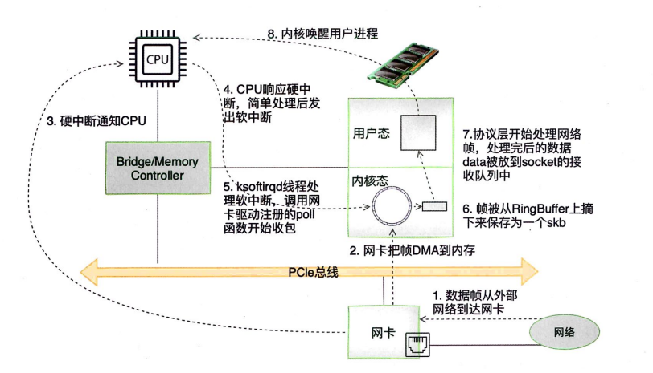
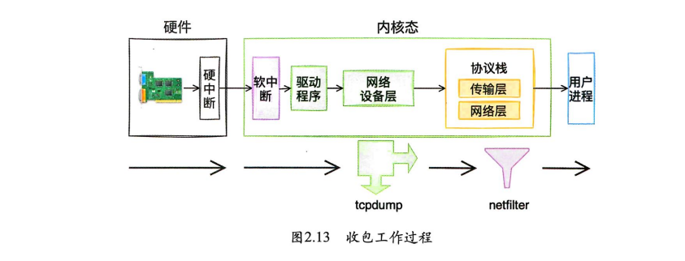
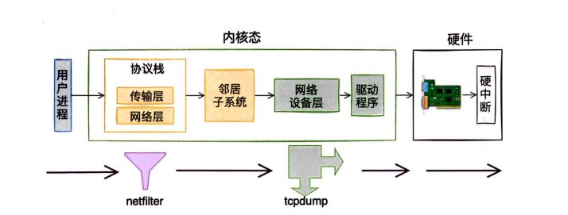
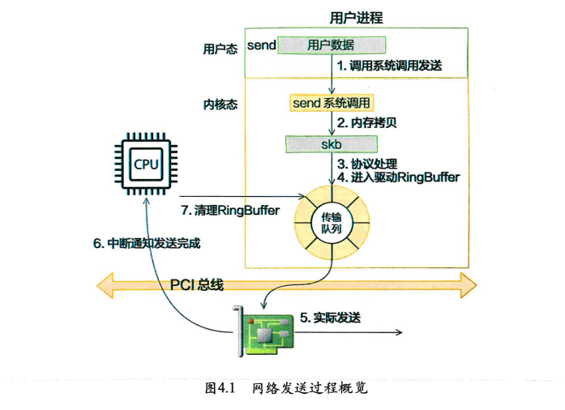
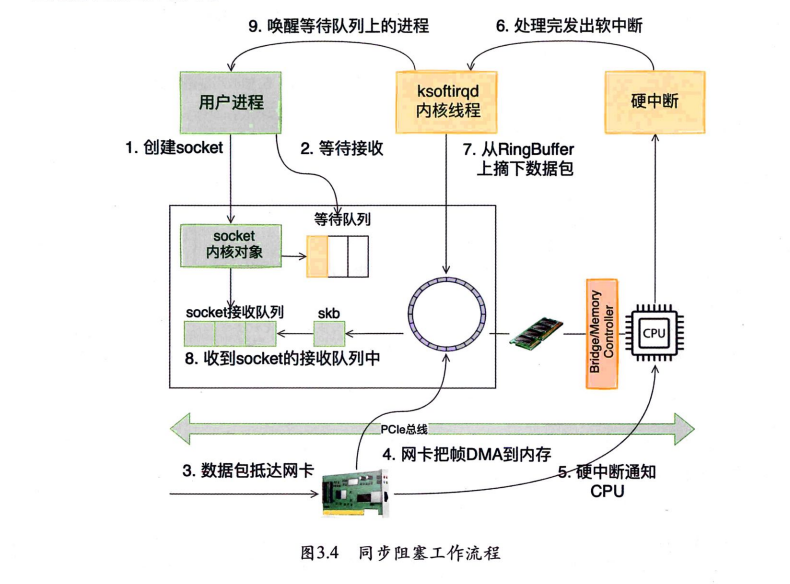
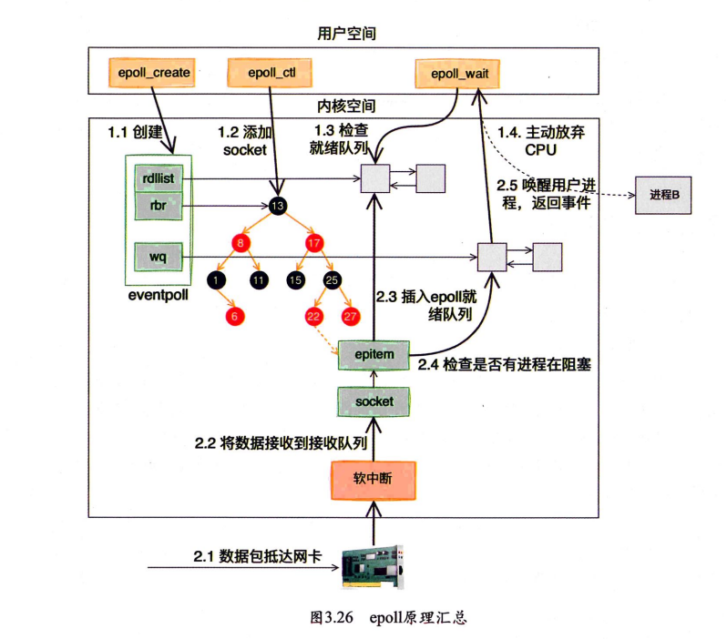

# linux网络原理

来源：深入理解Linux网络

### 内核收包过程

内核协议栈接收数据包的处理流程：网卡 内存 CPU 硬中断 软中断 RingBuffer skb socket

### iptables会影响tcpdump吗？

netfilter在协议层，而tcpdump工作在设备层，所以接收不受影响，发送会

### 发包过程

可以看到⽤户数据被拷贝到内核态，然后经过协议栈处理后进⼊RingBuffer，随后⽹卡驱动真正将数据发送了出去。当发送完成的时候，是通过硬中断来通知CPU，然后清理RingBuffer

### 处理网络包的开销

top查看处理网络包的开销

hi是CPU处理硬中断的开销，si是处理软中断的开销，都是以百分⽐的形式来展示的。

### epoll

同步阻塞方式会在创建socket后阻塞进程，收到消息才会唤醒，有进程上下文切换开销，并且对于服务端来说这种方式效率很低，对于客户端来说可能倒是需要等到返回数据再进一步行动

服务端承载太多的连接了，每个连接都创建进程不现实，不可能为了等待一个socket就阻塞

同步：一个进程只能等待一条连接

假设一个进程保持了一万条连接，如何发现哪条连接上可写可读？

可以循环遍历，但是效率太低，为了平衡，用了红黑树，socket编号，没用hash

linux提供了**IO多路复用select,poll,epoll**

当没有IO事件时，epoll会阻塞进程，一般会把socket设置成非阻塞

epoll的优势：一个进程多个连接的socket，只有在都没有事件时才阻塞
