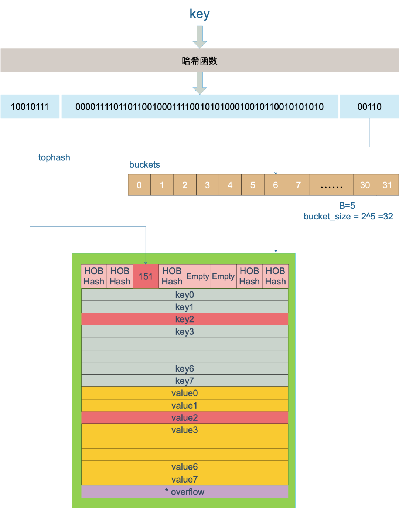

## 语言设计原理

### uintptr和unsafe.Pointer的区别

unsafe.Pointer只是单纯的通用指针类型，用于转换不同类型指针，它不可以参与指针运算；

而uintptr是用于指针运算的，GC 不把 uintptr 当指针，也就是说 uintptr 无法持有对象， uintptr 类型的目标会被回收；

unsafe.Pointer 可以和 普通指针 进行相互转换；

unsafe.Pointer 可以和 uintptr 进行相互转换。

### 内存管理

#### 堆内存管理

总结起来关于Go内存分配管理的策略有如下几点：

- Go在程序启动时，会向操作系统申请一大块内存，由`mheap`结构全局管理。
- Go内存管理的基本单元是`mspan`，每种`mspan`可以分配特定大小的object。
- `mcache`, `mcentral`, `mheap`是Go内存管理的三大组件，`mcache`管理线程在本地缓存的`mspan`；`mcentral`管理全局的`mspan`供所有线程使用；`mheap`管理Go的所有动态分配内存。
- 一般小对象通过`mspan`分配内存；大对象则直接由`mheap`分配内存。

`go tool compile -m main.go`打印优化决定，可以看出是否逃逸到堆
借助命令`go tool compile -S main.go`，可以显示该程序的汇编代码，也可以明确地向我们展示内存的分配

**小于32KB内存块的分配策略**

当程序里发生了32kb以下的小块内存申请时，Go会从一个叫做的mcache的本地缓存给程序分配内存。这个本地缓存mcache持有一系列的大小为32kb的内存块，这样的一个内存块里叫做`mspan`，它是要给程序分配内存时的分配单元。

在Go的调度器模型里，每个线程M会绑定给一个处理器P，在单一粒度的时间里只能做多处理运行一个goroutine，每个P都会绑定一个上面说的本地缓存`mcache`。当需要进行内存分配时，当前运行的goroutine会从mcache中查找可用的mspan。从本地mcache里分配内存时不需要加锁，这种分配策略效率更高。

mcache持有的这一系列的mspan并不都是统一大小的，而是按照大小，从8字节到32KB分了大概70类的msapn。

现在，我们可能会好奇，如果分配内存时mcachce里没有空闲的32字节的mspan了该怎么办？Go里还为每种类别的mspan维护着一个`mcentral`。

mcentral的作用是为所有mcache提供切分好的mspan资源。**每个central会持有一种特定大小的全局mspan列表**，包括已分配出去的和未分配出去的。每个mcentral对应一种mspan，当工作线程的mcache中没有合适（也就是特定大小的）的mspan时就会从mcentral 去获取。mcentral被所有的工作线程共同享有，存在多个goroutine竞争的情况，因此从mcentral获取资源时需要加锁。

mcentral里维护着两个双向链表，nonempty表示链表里还有空闲的mspan待分配。empty表示这条链表里的mspan都被分配了object。

简单说下mcache从mcentral获取和归还mspan的流程：

- 获取 加锁；从nonempty链表找到一个可用的mspan；并将其从nonempty链表删除；将取出的mspan加入到empty链表；将mspan返回给工作线程；解锁。
- 归还 加锁；将mspan从empty链表删除；将mspan加入到nonempty链表；解锁。

当mcentral没有空闲的mspan时，会向`mheap`申请。而mheap没有资源时，会向操作系统申请新内存。mheap主要用于大对象的内存分配，以及管理未切割的mspan，用于给mcentral切割成小对象。

同时我们也看到，mheap中含有所有规格的mcentral，所以，当一个mcache从mcentral申请mspan时，只需要在独立的mcentral中使用锁，并不会影响申请其他规格的mspan。

上面说了每种尺寸的mspan都有一个全局的列表存放在mcentral里供所有线程使用，所有mcentral的集合则是存放于mheap中的。mheap里的`arena` 区域是真正的堆区，运行时会将 8KB 看做一页，这些内存页中存储了所有在堆上初始化的对象。运行时使用二维的 runtime.heapArena 数组管理所有的内存，每个 runtime.heapArena 都会管理 **64MB** 的内存。

**大于32KB内存块的分配策略**

Go没法使用工作线程的本地缓存mcache和全局中心缓存mcentral上管理超过32KB的内存分配，所以对于那些超过32KB的内存申请，会直接从堆上(mheap)上分配对应的数量的内存页（**每页大小是8KB**）给程序。

#### 栈内存管理

在Go应用程序运行时，每个goroutine都维护着一个自己的栈区，这个栈区只能自己使用不能被其他goroutine使用。栈区的初始大小是2KB（比x86_64架构下线程的默认栈2M要小很多），在goroutine运行的时候栈区会按照需要增长和收缩，占用的内存最大限制的默认值在64位系统上是1GB。

分段栈：

Go 1.3 版本前使用的栈结构是分段栈，随着goroutine 调用的函数层级的深入或者局部变量需要的越来越多时，运行时会调用 runtime.morestack 和 runtime.newstack创建一个新的栈空间，这些栈空间是不连续的，但是当前 goroutine 的多个栈空间会以双向链表的形式串联起来，运行时会通过指针找到连续的栈片段

分段栈虽然能够按需为当前 goroutine 分配内存并且及时减少内存的占用，但是它也存在一个比较大的问题：
- 如果当前 goroutine 的栈几乎充满，那么任意的函数调用都会触发栈的扩容，当函数返回后又会触发栈的收缩，如果在一个循环中调用函数，栈的分配和释放就会造成巨大的额外开销，这被称为热分裂问题（Hot split）。

连续栈：

连续栈可以解决分段栈中存在的两个问题，其核心原理就是每当程序的栈空间不足时，初始化一片比旧栈大一倍的新栈并将原栈中的所有值都迁移到新的栈中，新的局部变量或者函数调用就有了充足的内存空间。使用连续栈机制时，栈空间不足导致的扩容会经历以下几个步骤：

- 调用用runtime.newstack在内存空间中分配更大的栈内存空间；
- 使用runtime.copystack将旧栈中的所有内容复制到新的栈中；
- 将指向旧栈对应变量的指针重新指向新栈；
- 调用runtime.stackfree销毁并回收旧栈的内存空间；

请注意**栈扩容后同一个变量的内存地址会发生变化**

每个goroutine都维护着自己的栈区，栈结构是连续栈，是一块连续的内存，在goroutine的类型定义的源码里我们可以找到标记着栈区边界的stack信息，stack里记录着栈区边界的高位内存地址和低位内存地址

栈内容的申请也是和堆一样，先去当前线程的对应尺寸的mcache里去申请，不够的时候mache会从全局的mcental里取内存等等

栈扩容：

编译器会为函数调用插入运行时检查runtime.morestack，它会在几乎所有的函数调用之前检查当前goroutine 的栈内存是否充足，如果当前栈需要扩容，会调用runtime.newstack 创建新的栈

旧栈的大小是通过我们上面说的保存在goroutine中的stack信息里记录的栈区内存边界计算出来的，然后用旧栈两倍的大小创建新栈，创建前会检查是新栈的大小是否超过了单个栈的内存上限。

栈缩容：

在goroutine运行的过程中，如果栈区的空间使用率不超过1/4，那么在垃圾回收的时候使用runtime.shrinkstack进行栈缩容，当然进行缩容前会执行一堆前置检查，都通过了才会进行缩容

如果要触发栈的缩容，新栈的大小会是原始栈的一半，不过如果新栈的大小低于程序的最低限制 2KB，那么缩容的过程就会停止。缩容也会调用扩容时使用的 runtime.copystack 函数开辟新的栈空间，将旧栈的数据拷贝到新栈以及调整原来指针的指向。

### GC

可以配合[undergo](/public/series/dev/go/undergo.md#垃圾回收-garbage-collection)

[ref](https://www.yuque.com/aceld/golang/zhzanb)

标记清除算法明了，过程鲜明干脆，但是也有非常严重的问题。

- STW，stop the world；让程序暂停，程序出现卡顿 (重要问题)；
- 标记需要扫描整个heap；
- 清除数据会产生heap碎片。

**Go V1.3** 做了简单的优化,将STW的步骤提前, 减少STW暂停的时间范围

**将STW的步骤提前了一步**，因为在Sweep清除的时候，可以不需要STW停止，因为这些对象已经是不可达对象了，不会出现回收写冲突等问题。

**没有STW的三色标记法会出现错误**

**Go V1.5**

可以看出，有两种情况，在三色标记法中，是不希望被发生的。

- 条件1: 一个白色对象被黑色对象引用(白色被挂在黑色下)
- 条件2: 灰色对象与它之间的可达关系的白色对象遭到破坏(灰色同时丢了该白色)
如果当以上两个条件同时满足时，就会出现对象丢失现象!

插入屏障与删除屏障对栈上对象不会生效

- 插入写屏障：黑色节点新引用到白色节点前，把白色节点变为灰色
- 删除写屏障：灰色节点删除到白色节点的引用时，把白色节点变成灰色节点

插入写屏障不足：结束时需要STW来重新扫描栈
删除写屏障不足：回收精度低，需要下一次回收才能回收掉被删除引用的白色垃圾对象

>疑问：栈按理说不应该进行GC，为什么会扫描栈空间？如果栈指针引用了堆上的对象，那不还是按照堆对象进行gc吗？和栈有什么关系？还是说栈指针引用了堆对象后，需要对该栈帧进行扫描，但是不使用屏障

上述猜想是正确的，这里的栈对象本身还是在堆上，只是被栈上指针引用，GO的gc会扫描栈来找到栈指针指向的堆对象，来确定引用关系

**Go V1.8**

插入写屏障和删除写屏障的短板：

- 插入写屏障：结束时需要STW来重新扫描栈，标记栈上引用的白色对象的存活； 
- 删除写屏障：回收精度低，GC开始时STW扫描堆栈来记录初始快照，这个过程会保护开始时刻的所有存活对象。 

Go V1.8版本引入了混合写屏障机制（hybrid write barrier），避免了对栈re-scan的过程，极大的减少了STW的时间。结合了两者的优点。

1、GC开始将栈上的对象全部扫描并标记为黑色(之后不再进行第二次重复扫描，无需STW)，

2、GC期间，任何在栈上创建的新对象，均为黑色。

3、被删除的对象标记为灰色。

4、被添加的对象标记为灰色。

满足: 变形的弱三色不变式.


### GMP

可以配合[undergo](/public/series/dev/go/undergo.md#gmp-gpm)

[ref](https://www.yuque.com/aceld/golang/zhzanb)

调度器策略:

1）work stealing机制

当本线程无可运行的G时，先尝试全局队列，再尝试从其他线程绑定的P偷取G，而不是销毁线程。

2）hand off机制

当本线程因为G进行**系统调用阻塞**时，线程释放绑定的P，把P转移给其他空闲的线程执行。

场景:

创建goroutine时，可能创建在本地队列中，满足局部性，如果满了，会分割队列，拿出队列前面的一半打乱放入全局队列

>局部性，同一个核有l1,l2 cache，分配到同一个线程容易命中，提高执行效率

也可能会唤醒其他M，分配到那个M

自旋线程就是M对应的P本地队列没有要执行的协程，但是该线程是运行状态

偷取其他P的G时，也是分割队列，取后一半

#### m0 g0

m0是第一个线程，在全局变量runtime.m0中，不分配在堆上

g0是每个m的绑定的唯一goroutine，负责goroutine调度

### 几种并发模型

**传统的并发模型**

多线程编程，采用**共享内存**的方式，加锁解锁资源

**基于消息的并发模型**

Actor: 
- 消息是直接发送到对方的，没有中介
- 消息的收发是异步的，类似邮箱

CSP:
- 消息是发送到channel的，不区分发送者与接收者对象是谁
- 消息的收发是同步的，或者有限异步

它们都是描述独立的流程通过消息传递进行通信 主要的区别在于：在CSP消息交换是同步的(即两个流程的执行"接触点"的，在此他们交换消息)，而Actor模型是完全解耦的，可以在任意的时间将消息发送给任何未经证实的接受者。

由于Actor享有更大的相互独立,因为他可以根据自己的状态选择处理哪个传入消息。自主性更大些。

在Go语言中为了不堵塞流程，程序员必须检查不同的传入消息，以便预见确保正确的顺序。CSP好处是Channel不需要缓冲消息，而Actor理论上需要一个无限大小的邮箱作为消息缓冲

## 《GO语言精进之路》

### GMP

Go从1.5版本开始将P的默认数量由1改为CPU核的数量(实际上还乘了每个核上硬线程数量)

#### I/O

Go运行时已经实现了**netpoller**，这使得即便G发起网络I/O操作也不会导致M被阻塞（仅阻塞G），因而不会导致大量线程（M）被创建出来。但是对于常规文件的I/O操作一旦阻塞，那么线程（M）将进入挂起状态，等待I/O返回后被唤醒。这种情况下P将与挂起的M分离，再选择一个处于空闲状态（idle）的M。如果此时没有空闲的M，则会新创建一个M（线程），这就是大量文件I/O操作会导致大量线程被创建的原因。

Go开发团队的Ian Lance Taylor在Go 1.9版本中增加了一个针对文件I/O的Poller，它可以像netpoller那样，在G操作那些支持监听的（pollable）文件描述符时，仅阻塞G，而不会阻塞M。**不过该功能依然对常规文件无效，常规文件是不支持监听的**。但对于goroutine调度器而言，这也算是一个不小的进步了。

#### 抢占式调度

栈增长抢占：

原理是在每个函数或方法的入口加上一段额外的代码，让运行时有机会检查是否需要执行抢占调度。

这种协作式抢占调度的解决方案只是局部解决了“饿死”问题，对于没有函数调用而是纯算法循环计算的G，goroutine调度器依然无法抢占

异步抢占：

但Go 1.14版本中加入了**基于系统信号的goroutine抢占式调度机制**，上述问题被解决

---

运行时间过长被调度：

可以看出，如果一个G任务运行超过10ms，sysmon就会认为其运行时间太久而发出抢占式调度的请求。一旦G的抢占标志位被设为true，那么在这个G下一次调用函数或方法时，运行时便可以将G抢占并移出运行状态，放入P的本地运行队列中（如果P的本地运行队列已满，那么将放在全局运行队列中），等待下一次被调度。

channel阻塞或网络I/O情况下的调度:

如果G被阻塞在某个channel操作或网络I/O操作上，那么G会被放置到某个等待队列中，而M会尝试运行P的下一个可运行的G。如果此时P没有可运行的G供M运行，那么M将解绑P，并进入挂起状态。当I/O操作完成或channel操作完成，在等待队列中的G会被唤醒，标记为runnable（可运行），并被放入某个P的队列中，绑定一个M后继续执行。

系统调用阻塞情况下的调度:

如果G被阻塞在某个系统调用上，**那么不仅G会阻塞，执行该G的M也会解绑P（实质是被sysmon抢走了），与G一起进入阻塞状态**。如果此时有空闲的M，则P会与其绑定并继续执行其他G；如果没有空闲的M，但仍然有其他G要执行，那么就会创建一个新M（线程）。当系统调用返回后，阻塞在该系统调用上的G会尝试获取一个可用的P，如果有可用P，之前运行该G的M将绑定P继续运行G；如果没有可用的P，那么G与M之间的关联将解除，同时G会被标记为runnable，放入全局的运行队列中，等待调度器的再次调度

##### sysmon

监控线程sysmon由main goroutine创建，不是工作线程，不受GPM模型管理，不需要P，以g0执行一系列重复任务

sysmon每20us~10ms启动一次，主要完成如下工作:

- 释放闲置超过5 分钟的 span 物理内存； 
- 如果超过2 分钟没有垃圾回收，强制执⾏； 
- 将⻓时间未处理的 netpoll 添加到全局队列； 
- 向⻓时间运⾏的 G 任务发出抢占调度(超过10ms的 g，会进⾏ retake)；
- 收回因 syscall ⻓时间阻塞的 P；

## 《Go系统调用与阻塞处理》

[ref](https://mp.weixin.qq.com/s/u6vC_sUf5ultPRhaJnSRHQ)

在 Go 里面阻塞主要分为以下 4 种场景：

1. 由于原子、互斥量或通道操作调用导致  Goroutine  阻塞，调度器将把当前阻塞的 Goroutine 切换出去，重新调度 LRQ 上的其他 Goroutine；
2. 由于网络请求和 IO 操作导致  Goroutine  阻塞。Go 程序提供了网络轮询器（NetPoller）来处理网络请求和 IO 操作的问题，其后台通过 kqueue（MacOS），epoll（Linux）或  iocp（Windows）来实现 IO 多路复用。通过使用 NetPoller 进行网络系统调用，调度器可以防止  Goroutine  在进行这些系统调用时阻塞 M。这可以让 M 执行 P 的  LRQ  中其他的  Goroutines，而不需要创建新的 M。执行网络系统调用不需要额外的 M，网络轮询器使用系统线程，它时刻处理一个有效的事件循环，有助于减少操作系统上的调度负载。用户层眼中看到的 Goroutine 中的“block socket”，实现了 goroutine-per-connection 简单的网络编程模式。实际上是通过 Go runtime 中的 netpoller 通过 Non-block socket + I/O 多路复用机制“模拟”出来的。
3. 当调用一些系统方法的时候（如文件 I/O），如果系统方法调用的时候发生阻塞，这种情况下，网络轮询器（NetPoller）无法使用，而进行系统调用的  G1  将阻塞当前 M1。调度器引入 其它M 来服务 M1 的P。
4. 如果在 Goroutine 去执行一个 sleep 操作，导致 M 被阻塞了。Go 程序后台有一个监控线程 sysmon，它监控那些长时间运行的 G 任务然后设置可以强占的标识符，别的 Goroutine 就可以抢先进来执行。

>time.Sleep会导致m被阻塞吗？
futex是系统调用，所以会阻塞m，但是m应该只会在一小段时间阻塞
In summary, when we call Sleep() function in Golang,
App calls sleep of Golang -> Golang calls futex of Linux -> futex utilizes hrtimer to be timer.
[ref](https://xwu64.github.io/2019/02/27/Understanding-Golang-sleep-function/)

sysmon负责：

1. 检查死锁runtime.checkdead
2. 运行计时器 — 获取下一个需要被触发的计时器；
3. 定时从 netpoll 中获取 ready 的协程
4. Go 的抢占式调度：当 sysmon 发现 M 已运行同一个 G（Goroutine）10ms 以上时，它会将该 G 的内部参数 preempt 设置为 true。然后，在函数序言中，当 G 进行函数调用时，G 会检查自己的 preempt 标志，如果它为 true，则它将自己与 M 分离并推入“全局队列”。由于它的工作方式（函数调用触发），在 for{} 的情况下并不会发生抢占，如果没有函数调用，即使设置了抢占标志，也不会进行该标志的检查。Go1.14 引入抢占式调度（使用信号的异步抢占机制），sysmon 仍然会检测到运行了 10ms 以上的 G（goroutine）。然后，sysmon 向运行 G 的 P 发送信号（SIGURG）。Go 的信号处理程序会调用P上的一个叫作 gsignal 的 goroutine 来处理该信号，将其映射到 M 而不是 G，并使其检查该信号。gsignal 看到抢占信号，停止正在运行的 G。
5. 在满足条件时触发垃圾收集回收内存；
6. 打印调度信息,归还内存等定时任务.

## 《Go专家编程》

### select

select的case语句**读channel不会阻塞，尽管channel中没有数据**。这是由于case语句编译后调用读channel时会明确传入不阻塞的参数，此时读不到数据时不会将当前goroutine加入到等待队列，而是直接返回。

### slice

```go
s1 := make([]int, 5, 10)
s2 := s1[:5:7] // 第三位也是cap，不能超过s1的cap
```

使用copy()内置函数拷贝两个切片时，会将源切片的数据逐个拷贝到目的切片指向的数组中，拷贝数量取两个切片长度的最小值。

例如长度为10的切片拷贝到长度为5的切片时，将会拷贝5个元素。

也就是说，copy过程中不会发生扩容。

**扩容规则**

Go1.18开始：

先判断旧的容量，如果小于256，2倍扩容。否则计算增长因子(growth factor)扩容，增长因子使得大切片(>256)的扩容更加平滑，随着容量的增加，增长因子会越来越小，直到无限趋近于1.25倍

最后，进行内存对齐计算，和老版本计算规则一样

### map

结构：

```go
type hmap struct {
    count     int // 当前保存的元素个数
    ...
    B         uint8  // 表示bucket的个数，实际个数为2^B
    ...
    buckets    unsafe.Pointer // bucket数组指针
    ...
}

type bmap struct {
    tophash [8]uint8 //存储哈希值的高8位
    data    byte[1]  //key value数据:key/key/key/.../value/value/value...
    overflow *bmap   //溢出bucket的地址
}
```
每个bucket可以存储8个键值对。

- tophash是个长度为8的数组，哈希值相同的键（准确的说是哈希值低位相同的键）存入当前bucket时会将哈希值的高位存储在该数组中，以方便后续匹配。
- data区存放的是key-value数据，存放顺序是key/key/key/...value/value/value，如此存放是为了节省字节对齐带来的空间浪费。
- overflow 指针指向的是下一个bucket，据此将所有冲突的键连接起来。

注意：上述中data和overflow并不是在结构体中显示定义的，而是直接通过指针运算进行访问的。

查找过程：


### string

因为string通常指向字符串字面量，而字符串字面量存储位置是只读段，而不是堆或栈上，所以才有了string不可修改的约定。

### defer

```go
func deferFuncParameter() {
    var aInt = 1

    defer fmt.Println(aInt)

    aInt = 2
    return
}
```

输出1

### array

数组长度不可变，但可以改变取值

### range 

slice:

遍历slice前会先获以slice的长度len_temp作为循环次数，循环体中，每次循环会先获取元素值，如果for-range中接收index和value的话，则会对index和value进行一次赋值。

由于循环开始前循环次数就已经确定了，所以循环过程中新添加的元素是没办法遍历到的。

另外，数组与数组指针的遍历过程与slice基本一致，不再赘述。

map:

遍历map时没有指定循环次数，循环体与遍历slice类似。由于map底层实现与slice不同，map底层使用hash表实现，插入数据位置是随机的，所以遍历过程中新插入的数据不能保证遍历到。

channel:

channel遍历是依次从channel中读取数据,读取前是不知道里面有多少个元素的。如果channel中没有元素，则会阻塞等待，如果channel已被关闭，则会解除阻塞并退出循环。

### RWMutex

```go
type RWMutex struct {
    w           Mutex  //用于控制多个写锁，获得写锁首先要获取该锁，如果有一个写锁在进行，那么再到来的写锁将会阻塞于此
    writerSem   uint32 //写阻塞等待的信号量，最后一个读者释放锁时会释放信号量
    readerSem   uint32 //读阻塞的协程等待的信号量，持有写锁的协程释放锁后会释放信号量
    readerCount int32  //记录读者个数
    readerWait  int32  //记录写阻塞时读者个数
}
```

**写操作是如何阻止写操作的**

读写锁包含一个互斥锁(Mutex)，写锁定必须要先获取该互斥锁，如果互斥锁已被协程A获取（或者协程A在阻塞等待读结束），意味着协程A获取了互斥锁，那么协程B只能阻塞等待该互斥锁。

所以，写操作依赖互斥锁阻止其他的写操作。

**写操作是如何阻止读操作的**

我们知道RWMutex.readerCount是个整型值，用于表示读者数量，不考虑写操作的情况下，每次读锁定将该值+1，每次解除读锁定将该值-1，所以readerCount取值为`[0, N]`，N为读者个数，实际上最大可支持2^30个并发读者。

当写锁定进行时，会先将readerCount减去2^30，从而readerCount变成了负值，此时再有**读锁定到来时检测到readerCount为负值，便知道有写操作在进行，只好阻塞等待。而真实的读操作个数并不会丢失，只需要将readerCount加上2^30即可获得**。

所以，写操作将readerCount变成负值来阻止读操作的。

**读操作是如何阻止写操作的**

读锁定会先将RWMutext.readerCount加1，此时写操作到来时发现读者数量不为0，会阻塞等待所有读操作结束。

所以，读操作通过readerCount来将来阻止写操作的。

**为什么写锁定不会被饿死**

我们知道，写操作要等待读操作结束后才可以获得锁，写操作等待期间可能还有新的读操作持续到来，如果写操作等待所有读操作结束，很可能被饿死。然而，通过RWMutex.readerWait可完美解决这个问题。

写操作到来时，会把RWMutex.readerCount值拷贝到RWMutex.readerWait中，用于标记排在写操作前面的读者个数。

前面的读操作结束后，除了会递减RWMutex.readerCount，还会递减RWMutex.readerWait值，当RWMutex.readerWait值变为0时唤醒写操作。

所以以，写操作就相当于把一段连续的读操作划分成两部分，前面的读操作结束后唤醒写操作，写操作结束后唤醒后面的读操作。


### 逃逸分析

1. 局部变量被外部引用必然逃逸，被闭包引用也会逃逸
2. 当栈空间不足以存放当前对象时或无法判断当前切片长度时会将对象分配到堆中
3. interface无法在编译时判断类型，也会逃逸

### 反射 接口

```go
type Myint int

var i int
var j Myint
```

i与j虽然底层类型一样，但是**静态类型不同**，interface就是一种特殊的静态类型

```go
var r io.Reader
tty, err := os.OpenFile("/dev/tty", os.O_RDWR, 0)
if err != nil {
    return nil, err
}
r = tty
```

r的类型始终是io.Readerinterface类型，无论其存储什么值。

r保存了一个(value, type)对来表示其所存储值的信息。 value即为r所持有元素的值，type即为所持有元素的**动态类型(不是底层类型)**

```go
	var i interface{}
	type myint int
	var j myint
	i = j
	fmt.Println(reflect.TypeOf(i)) // main.myint
```
注意：反射是针对interface类型变量的，其中TypeOf()和ValueOf()接受的参数都是interface{}类型的，也即值是被转成了interface传入的。

反射三定律：

- 反射第一定律：反射可以将interface类型变量转换成反射对象
- 反射第二定律：反射可以将反射对象还原成interface对象
- 反射第三定律：反射对象可修改，value值必须是可设置的

## 面试相关知识点记录

### atomic

原子操作由底层硬件支持，而锁则由操作系统的调度器实现。**锁应当用来保护一段逻辑，对于一个变量更新的保护，原子操作通常会更有效率**，并且更能利用计算机多核的优势，如果要更新的是一个复合对象，则应当使用`atomic.Value`封装好的实现。

### 多个变量同时赋值

```go
    // 下面的赋值是语法糖，前面的赋值不会影响后面的赋值，因为有临时变量
	// tmp := dp[j+1]
	// dp[j+1] = pre+1
	// pre = tmp
	dp[j+1], pre = pre+1, dp[j+1]
```