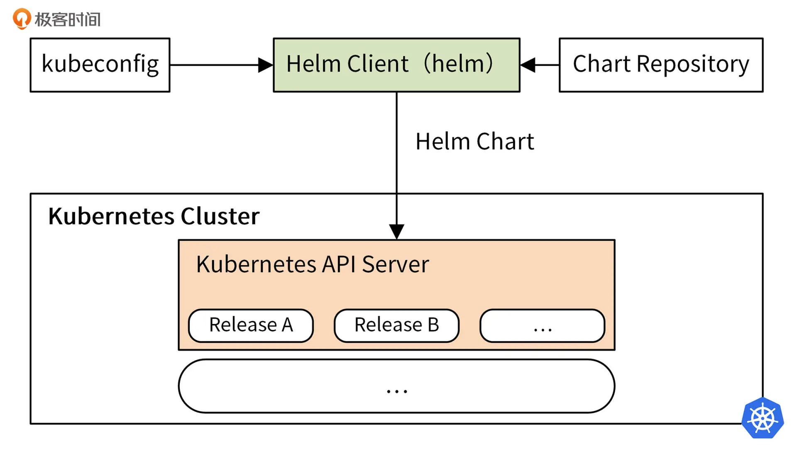

# helm



### helm安装

```shell
wget https://get.helm.sh/helm-v3.6.3-linux-amd64.tar.gz
tar -xvzf helm-v3.6.3-linux-amd64.tar.gz
mv linux-amd64/helm /bin/
chmod +x /bin/helm
```

### helm自动补全

```shell
helm completion bash > $HOME/.helm-completion.bash
echo 'source $HOME/.helm-completion.bash' >> ~/.bashrc
bash
```

### helm搜索

两种方式：
1. helm search repo (keyword) 本地repo搜索
2. helm search hub (keyword) artifact hub网络搜索

### helm命令

```shell
helm repo add bitnami https://charts.bitnami.com/bitnami
helm install bitnami/mysql --generate-name # 给生成的release自动生成名字
helm status (release)
helm show values (release)
helm get values mysql-1629528555
helm list
helm rollback (release) (revision)
helm history (release)
helm upgrade mysql-1629528555 bitnami/mysql --set auth.rootPassword='iam59!z$'
helm dependency update
```

### value配置

-f, --values：使用 YAML 文件覆盖配置。可以指定多次，优先使用最右边的文件。

--set：通过命令行的方式对指定配置项进行覆盖。

如果同时使用两种方式，则 --set 中的值会被合并到 --values 中，但是 --set 中的值优先级更高。在--set中覆盖的内容会被保存在 ConfigMap 中。你可以通过 `helm get values release-name` 来查看指定 Release 中 --set 设置的值，也可以通过运行 `helm upgrade` 并指定 --reset-values 字段，来清除 --set中设置的值。

-f多用于多环境values配置，可以根据环境快速切换

### chart依赖关系

[ref](https://helm.sh/zh/docs/topics/charts/)

导入chart，写入依赖的chart，`helm dependency update`下载
可以通过tag和condition来控制是否使用依赖的chart，values.yaml中配置是否开启

### crd管理

CRD 文件 无法模板化，必须是普通的YAML文档

Helm会尝试加载CRD目录中 所有的 文件到Kubernetes。

不像大部分的Kubernetes对象，CRD是全局安装的。因此Helm管理CRD时会采取非常谨慎的方式。 CRD受到以下限制：

- CRD从不重新安装。 如果Helm确定crds/目录中的CRD已经存在（忽略版本），Helm不会安装或升级。
- CRD从不会在升级或回滚时安装。Helm只会在安装时创建CRD。
- CRD从不会被删除。自动删除CRD会删除集群中所有命名空间中的所有CRD内容。因此Helm不会删除CRD。

### helm解决的问题

一个应用包含多个服务，每个服务都有各自的配置，当在不同的环境下需要不同的配置时，传统方案很难优雅解决，只能繁琐的为每个服务编写文件并各自维护。

helm由模板+配置组成，可以灵活的根据环境进行配置

### helm模板使用

[helm模板入门](https://juejin.cn/post/6844904199818313735)

include和template不同，template引入一个模板，include通常是引入部分

```yaml
{{ include "path/to/child.tpl" . | indent 4 }}
```

block和define类似，block定义一个可重用块，define定义一个模板，define可以传参来重写block的定义

所有的 Helm 内置变量都以大写字母开头，以便与用户定义的 value 进行区分，例如.Release.Name、.Capabilities.KubeVersion

with可以限制上下文范围

```yaml
{{ with .Values.someKey }}
  # 在这里，. 表示 .Values.someKey 的值
  # 你可以在这个范围内进行操作
{{ end }}
```

toYaml将值转换成yaml格式的字符串，通常配上indent来插入一段yaml到template中，nindent和indent方法类似，不过nindent会在最开始的地方增加一个空行

双括号内的-代表消除空格，{{- end -}}消除左右两边的空格，会延伸到下一行

template/ 中的大多数文件都被视为Kubernetes资源清单(会被发往Kubernetes创建对应资源)，NOTES.txt是个例外，名称以下划线（_） 开头的文件不会被当做资源发往Kubernetes，但是可以被其他模板所引用。

### chartmuseum

私有chart仓库

cm-push是一个用来将 chart 推送到 ChartMuseum 的插件

```shell
helm plugin install https://github.com/chartmuseum/helm-push

docker run --rm -it \
  -p 8080:8080 \
  -e DEBUG=1 \
  -e STORAGE=local \
  -e BASIC_AUTH_USER=admin \
  -e BASIC_AUTH_PASS=password \
  -e TLS_CERT=/charts/cm.crt \
  -e TLS_KEY=/charts/cm.key \
  -e STORAGE_LOCAL_ROOTDIR=/charts \
  -v $(pwd)/charts:/charts \
  ghcr.io/helm/chartmuseum:v0.14.0

```  