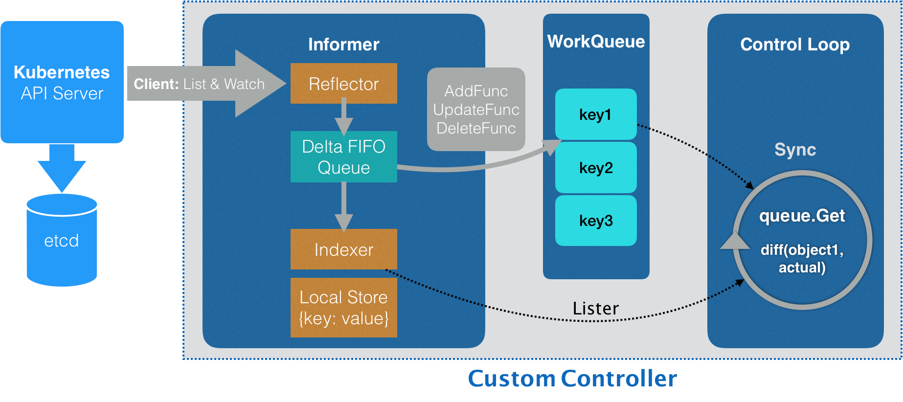

- [informer流程](#informer流程)
- [参考资料](#参考资料)

## informer流程

1. reflector.ListAndWatch方法调用client-go从apiserver获取和监听对应资源，api对象变化会将该事件以及对应的api对象组合放入Delta FIFO队列中
2. informer将读取增量队列，通过indexer根据事件类型不同创建或更新对象缓存
3. informer也会将读取的增量调用注册的eventhandler，入队workqueue，这里入队的只有name和namespace
4. 每经过resyncPeriod时间，informer的local store都会resync，同时触发UpdateFunc这个eventhandler
5. 接着进入control loop，从work queue中拿到name和namespace的key，去local store拿到对应的对象，（如果没有找到对象，意味着该事件是删除事件，需要将对象删除）这是期望状态，接着拿到实际状态并确保与期望状态一致

>实际状态也可能来自缓存对象的status字段

## 参考资料

深入剖析kubernetes专栏

kubebuilder官方文档

云原生应用开发书籍