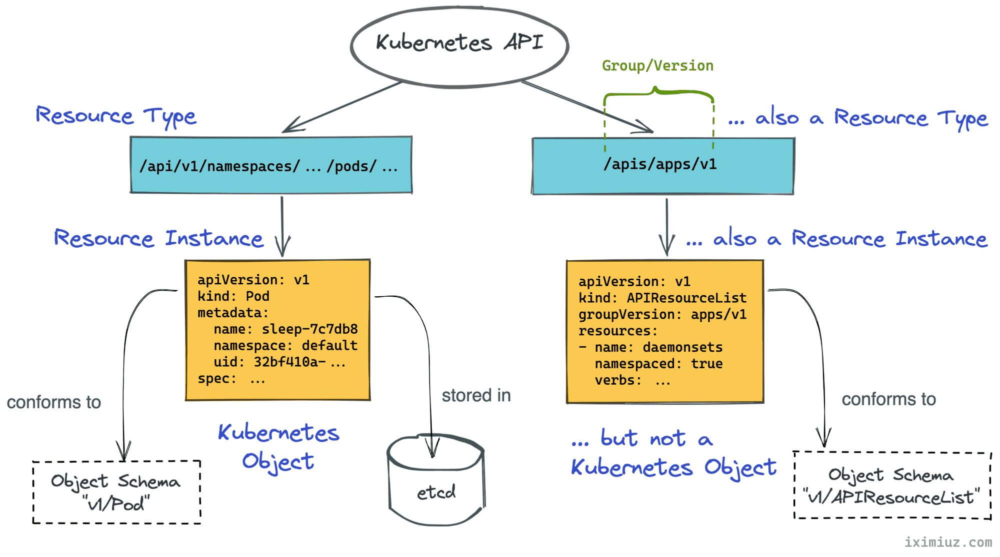
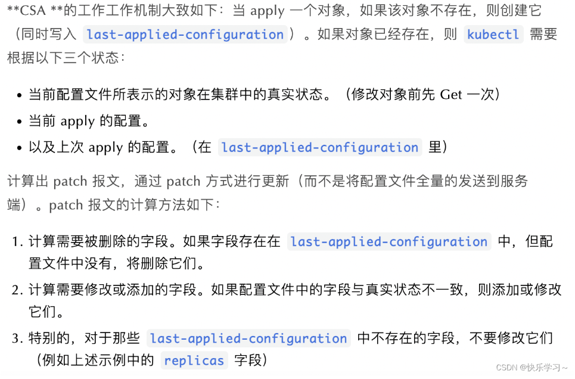

### GPU共享

[GPU-sharing](https://towardsdatascience.com/how-to-increase-gpu-utilization-in-kubernetes-with-nvidia-mps-e680d20c3181)

There are three approaches for sharing GPUs:
1. Time slicing
2. Multi-instance GPU (MIG)
3. Multi-Process Service (MPS)

### affinity

pod affinity: 

在pod配置文件中，用于管理pod与其它pod的关系，有required和preferred两种，另有pod antiaffinity

node affinity:

在pod配置文件中，用于管理pod与node的关系，有required和preferred两种

### etcd

etcd 的高可用方案有下面这 3 种思路：

1. 使用独立的 etcd 集群，独立的 etcd 集群自带高可用能力。
2. 在每个 Master 节点上，使用 Static Pod 来部署 etcd，多个节点上的 etcd 实例数据相互同步。每个 kube-apiserver 只与本 Master 节点的 etcd 通信。
3. 使用 CoreOS 提出的 self-hosted 方案，将 etcd 集群部署在 kubernetes 集群中，通过 kubernetes 集群自身的容灾能力来实现 etcd 的高可用。

### kubernetes API

[ref](https://iximiuz.com/en/posts/kubernetes-api-go-types-and-common-machinery/)

### kustomize

[入门介绍教程](https://zhuanlan.zhihu.com/p/669291774)
[官方文档](https://kubectl.docs.kubernetes.io/)

可以用于补充yaml配置和生成配置

kubectl kustomize (dir)

kubectl apply -k (dir)

#### GVK

[ref](https://iximiuz.com/en/posts/kubernetes-api-structure-and-terminology/#:~:text=Every%20resource%20representation%20follows%20a,representing%20a%20record%20of%20intent.)



**Summary**:
- Resource Type: apiserver HTTP endpoint
- Resource Instance: content when you kubectl get --raw Resource Type
- Kind: a specific data structure which Resource must conform
- Object: Resource which is persistent entity and has some mandate fields 

Turns out, in Kubernetes, **a `kind` is the name of an object schema**. Like the one you'd typically describe using a JSON schema vocabulary. In other words, **a kind refers to a particular data structure**, i.e. a certain composition of attributes and properties.

As per sig-architecture/api-conventions.md, kinds are grouped into three categories:

- Objects (Pod, Service, etc) - persistent entities in the system.
- Lists - (PodList, APIResourceList, etc) - collections of resources of one or more kinds.
- Simple - specific actions on objects (status, scale, etc.) or non-persistent auxiliary entities (ListOptions, Policy, etc).

Entities like ReplicaSet, Namespace, or ConfigMap are called Kubernetes Objects. **`Objects` are persistent entities in the Kubernetes system that represent an intent (desired state) and the status (actual state) of the cluster**.

Most of the Kubernetes API resources represent `Objects`. Unlike other forms of resources mandating only the kind field, Objects must have more field defined:

- kind - a string that identifies the schema this object should have
- apiVersion - a string that identifies the version of the schema the object should have
- metadata.namespace - a string with the namespace (defaults to "default")
- metadata.name - a string that uniquely identifies this object within the current namespace
- metadata.uid - a unique in time and space value used to distinguish between objects with the same name that have been deleted and recreated.

Additionally, the metadata dictionary may include labels and annotations fields, as well as some versioning and timestamp information.

>Fun fact - **The `kubectl api-resources` command actually lists not API resources but known types of Kubernetes Objects**. To list the true API resources instead, you'd need to run through a full discovery cycle querying every path returned by kubectl get --raw / recursively.

### Server Side Apply and Client Side Apply

[ref](https://blog.csdn.net/qq_43684922/article/details/128272461)

kubectl最初方式就是client side apply，自动填充kubectl.kubernetes.io/last-applied-configuration

kubectl apply时会判断该对象存不存在，使用patch或者create，也会**根据last-applied-configuration来判断哪些字段是被kubectl管理的**。



server side apply示例：

```shell
kubectl apply --server-side=true -f - <<EOF
apiVersion: v1
kind: ConfigMap
metadata:
  name: test-server-side-apply
data:
  a: "a"
  b: "b"
EOF

kubectl apply --server-side=true --field-manager="test" -f - <<EOF
apiVersion: v1
kind: ConfigMap
metadata:
  name: test-server-side-apply
data:
  a: "a"
  b: "c" 
EOF
# conflict
```

失去 last-applied-configuration 后，表达 ownership 的任务就落入了新引入的字段管理机制（field management）手中。根据以上输出的 yaml 的 metadata.managedFields 字段，我们不难得出它想表达的含义：该 configmap 中 data.a 和 data.b 字段都是由 kubectl 来管理的。

ssa的优点是更细粒度的管理，并且csa是深度绑定kubectl的，ssa可以让其他组件通过client-go包也实现apply机制

查看yaml时去掉其中大部分`grep -Ev "[kf.]:"`

### kubectl 多集群管理凭证

```shell
KUBECONFIG=config1:config2 kubectl config view --flatten > ~/.kube/config
# KUBECONFIG的config不可以直接使用~/.kube/config，会读取不到文件
```

### pod dns

hostAliases可以设置pod `/etc/hosts`文件内容

### dnsPolicy配置

ClusterFirst：通过CoreDNS来做域名解析，Pod内`/etc/resolv.conf`配置的DNS服务地址是集群DNS服务的kube-dns地址。

None：忽略集群DNS策略，需要您提供dnsConfig字段来指定DNS配置信息。

Default：Pod直接继承集群节点的域名解析配置。即在ACK集群直接使用ECS的/etc/resolv.conf文件（文件内配置的是阿里云DNS服务）。

ClusterFirstWithHostNet：强制在hostNetWork网络模式下使用ClusterFirst策略（默认使用Default策略）。

### kubernetes 常用临时镜像命令

#### mysql-client

```shell
#写操作测试
kubectl run mysql-client --image=mysql:5.7 -i --rm --restart=Never -- \
  mysql -h mysql-0.mysql <<EOF
CREATE DATABASE test;
CREATE TABLE test.messages (message VARCHAR(250));
INSERT INTO test.messages VALUES ('hello');
EOF
#读操作
kubectl run mysql-client --image=mysql:5.7 -i --rm --restart=Never --  mysql -h mysql-read -e "SELECT * FROM test.messages"
```

#### curl

kubectl run -i --tty --image curlimages/curl curl --restart=Never --rm curl web-0.nginx

在pod中使用curl访问apiserver
```shell
kubectl run kubectl-proxy --image=luksa/kubectl-proxy 
kubectl exec -it kubectl-proxy -- curl http://127.0.0.1:8001/api/v1/namespaces/default/services
```

#### DNS查询

```
kubectl run -i --tty --image busybox:1.28.4 busybox --restart=Never --rm /bin/sh 

kubectl run -it srvlookup --image=tutum/dnsutils --rm --restart=Never -- dig SRV kubia.default.svc.cluster.local
``` 
#### mysql客户端连接

```shell
kubectl run mysql-client --image=mysql:5.7 -i --rm --restart=Never --\
  mysql -h mysql-0.mysql <<EOF
CREATE DATABASE test;
CREATE TABLE test.messages (message VARCHAR(250));
INSERT INTO test.messages VALUES ('hello');
EOF
```
#### 使用hey增加访问压力

```
$ # Install hey
$ docker run -it -v /usr/local/bin:/go/bin golang:1.8 go get github.com/rakyll/hey

$ export APP_ENDPOINT=$(kubectl get svc sample-metrics-app -o template --template {{.spec.clusterIP}}); echo ${APP_ENDPOINT}
$ hey -n 50000 -c 1000 http://${APP_ENDPOINT}
```

### ingress nginx controller

[ref](https://kubernetes.github.io/ingress-nginx/)

### kubernetes镜像源

registry.aliyuncs.com/google_containers

registry.cn-hangzhou.aliyuncs.com/acs/

### serverless

#### 腾讯云serverless

[ref](https://cloud.tencent.com/document/product/457/98730)

腾讯云上实现daemonset的兼容，原理我理解是如下：
自己实现了daemonset的自定义控制器，控制器只会显示启动了与超级节点(virtual kubelet)一样的pod数量，但是实际的实现是类似于sidecar，每个pod注入一个容器，但是信息放在status中

这个自动注入可以在集群、pod、命名空间层面指定

### kubectl命令使用

#### patch 一个命名空间内所有deployment置零

```shell
#!/bin/bash

# 检查参数个数
if [ "$#" -ne 1 ]; then
  echo "Usage: $0 <namespace>"
  echo "Example: $0 my-namespace"
  exit 1
fi

# 命名空间参数
NAMESPACE=$1

# 检查命名空间是否存在
if ! kubectl get namespace "$NAMESPACE" &> /dev/null; then
  echo "Namespace '$NAMESPACE' does not exist."
  exit 1
fi

# 获取命名空间下的所有 Deployments
DEPLOYMENTS=$(kubectl get deployments -n "$NAMESPACE" -o name)

# 检查是否有任何 Deployments 被找到
if [ -z "$DEPLOYMENTS" ]; then
  echo "No deployments found in namespace '$NAMESPACE'."
  exit 0
fi

# 遍历每个 Deployment 并 patch
for DEPLOYMENT in $DEPLOYMENTS; do
  echo "Patching $DEPLOYMENT in namespace $NAMESPACE..."
  kubectl patch "$DEPLOYMENT" -n "$NAMESPACE" -p '{"spec":{"replicas":1}}'
done

echo "All deployments in namespace $NAMESPACE have been patched."
kubectl get -n $NAMESPACE deployments.apps
```

#### 统计k8s命名空间的deployment个数

```shell
#!/bin/bash

# 获取所有命名空间
namespaces=$(kubectl get ns --no-headers -o custom-columns=:metadata.name)

# 对每个命名空间，获取Deployment数量并输出
for ns in $namespaces; do
    # 使用grep来过滤掉可能的错误信息
    deployments=$(kubectl get deploy -n $ns 2>/dev/null | grep -v "No resources found" | wc -l)
    # 输出命名空间和Deployment数量
    echo "$ns  $deployments"
done
```

#### 列出deployment的名字、limit和request

```shell
kubectl get deployments -A -o=go-template='{{range .items}}{{.metadata.name}}:{{"\n"}}{{range .spec.template.spec.containers}}{{if .resources.limits.cpu}}cpulimit: {{.resources.limits.cpu}}{{else}}No CPU limit{{end}}{{"\n"}}{{if .resources.limits.memory}}memorylimit: {{.resources.limits.memory}}{{else}}No Memory limit{{end}}{{"\n"}}{{if .resources.requests.cpu}}cpurequest: {{.resources.requests.cpu}}{{else}}No CPU request{{end}}{{"\n"}}{{if .resources.requests.memory}}memoryrequest: {{.resources.requests.memory}}{{else}}No Memory request{{end}}{{"\n"}}{{end}}{{"\n"}}{{end}}'

# 包含两重循环：一层循环items，一层循环containers
# 最后一个{{"\n"}}代表的是每次输出完limits和requests后输出一个空行
```

#### apply yaml到每个命名空间

```shell
# 提供limitrange.yml
for ns in $(kubectl get ns --no-headers -o=custom-columns=NAME:.metadata.name); do kubectl apply -f limitrange.yml -n $ns; done
```

### sysctl

[ref](https://kubernetes.io/docs/tasks/administer-cluster/sysctl-cluster/)

社区分为两种，安全和不安全的，安全的默认启动，不安全的会影响一个node上所有的pod