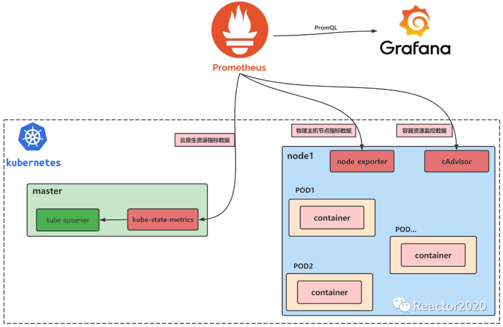

### prometheus operator

[ref](https://yunlzheng.gitbook.io/prometheus-book/part-iii-prometheus-shi-zhan/operator/what-is-prometheus-operators)

prometheus operator会根据prometheus、alertmanager、servicemonitor这些cr来新建对应的实例，这些cr本身不会有任何作用，只是yaml配置，而operator会根据这些配置来启动prometheus\alertmanager实例，也就是**statefulset形式启动的pod**。


Prometheus Operator目前提供的️4类资源：
- Prometheus：声明式创建和管理Prometheus Server实例；
- ServiceMonitor：负责声明式的管理监控配置；
- PrometheusRule：负责声明式的管理告警配置；
- Alertmanager：声明式的创建和管理Alertmanager实例。

#### 方案

- 通过kubelet暴露接口拿到kubelet指标/metrics 其它组件也可以
- 通过node-exporter拿到主机指标
- 通过blackbox-exporter拿到网络指标
- 通过kube-state-metrics拿到k8s资源对象和组件指标，从apiserver拿
- 通过在软件中使用prometheus库暴露接口拿到软件自定义指标
- metrics server从kubelet拿到指标，kubelet的summaryAPI，包含了cadvisor，这些指标被hpa用于scale，也被kubectl top指令使用

Kubernetes 云原生集群监控主要涉及到如下三类指标：node 物理节点指标、pod & container 容器资源指标和Kubernetes 云原生集群资源指标



cAdvisor 是用于监控容器引擎的，由于其监控的实用性，Kubernetes 已经默认将其与 Kubelet 融合，所以我们无需再单独部署 cAdvisor 组件来暴露节点中容器运行的信息，直接使用 Kubelet 组件提供的指标采集地址即可


### relabel机制

relabel_configs每段都是对临时值的处理！source表示值从哪来，target表示值去哪
如果没有instance标签，那么__address__最终赋值给instance，但是instance标签只是个名字，没有实际作用，而__address__标签是表示去抓取信息的对象
以双下划线__开头的标签属于特殊的标签，它们在重新标记后会被删除
Initially, aside from the configured per-target labels, a target's job label is set to the job_name value of the respective scrape configuration. The __address__ label is set to the <host>:<port> address of the target. After relabeling, the instance label is set to the value of __address__ by default if it was not set during relabeling. The __scheme__ and __metrics_path__ labels are set to the scheme and metrics path of the target respectively. The __param_<name> label is set to the value of the first passed URL parameter called <name>.

https://prometheus.io/docs/prometheus/latest/configuration/configuration/#relabel_config

https://blog.csdn.net/lovely_nn/article/details/123043447

https://yunlzheng.gitbook.io/prometheus-book/part-ii-prometheus-jin-jie/sd/

service-discovery-with-relabel

#### prometheus 标签替换例子
```yaml
  - job_name: 'localbind-blackbox-tcp'
    metrics_path: /probe
    params:
      module: [tcp_connect]
    static_configs:
    - targets:
      - 127.0.0.1:8100
      - 127.0.0.1:9600
    relabel_configs:
      - source_labels: [__address__] # 赋值临时值默认target的IP及端口
        target_label: __param_target # 用临时值给params中的target赋值
      - source_labels: [__param_target] 
        target_label: instance # 将IP端口赋值给instance
      - source_labels: [instance] 
        # regex: 127.0.0.1:(\d+)
        regex: 127.0.0.1:(.*) 
        replacement: "192.168.3.254:$1" # 与regex共用替换instance的值
        target_label: instance # 再赋值给instance=192.168.3.254:port
      - target_label: __address__ # 用replacement的值赋值到__address__
        replacement: 192.168.3.254:9115
```


