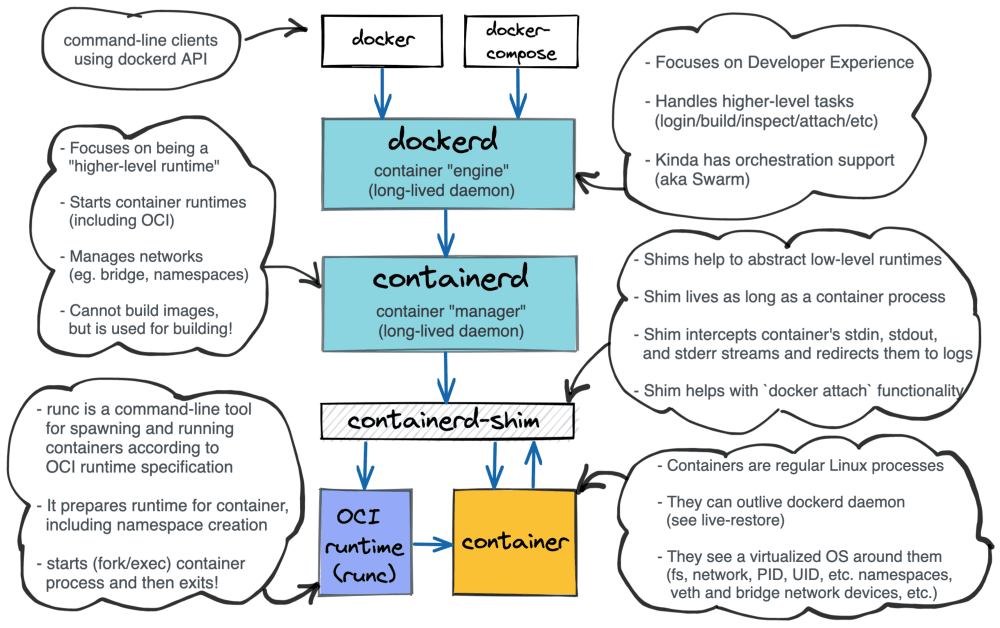

# https://iximiuz.com/

## 容器

### 方法一 直接安装

docker exec安装软件debug

### 方法二 换个镜像

换成有工具的镜像

### 方法三 挂载工具

缺点：需要重启容器

```shell
# 1. Prepare the debugger "image" (not quite):
$ docker create --name debugger busybox
$ mkdir debugger
$ docker export debugger | tar -xC debugger


# 2. Start the guinea-pig container (distroless):
$ docker run -d --rm \
  -v $(pwd)/debugger:/.debugger \
  --name my-distroless gcr.io/distroless/nodejs \
  -e 'setTimeout(() => console.log("Done"), 99999999)'


# 3. Start the debugging session:
$ docker exec -it my-distroless /.debugger/bin/sh
```

Appending the .debugger/bin folder to the $PATH env var has a different effect than prepending it! In the case of a name collision, the binaries from the target container will have precedence over the ones residing on the .debugger/bin mount.

If the opposite is desirable, you can inverse the order: `export PATH=/.debugger/bin:${PATH}`

nixery可以指定需要的工具

```shell
# 1. Prepare the debugger - it'll contain a shell (bash) and tcpdump!
$ docker create --name debugger nixery.dev/shell/tcpdump
$ mkdir debugger
$ docker export debugger | tar -xC debugger

# 2. Start the container that needs to be debugged
#    (notice how the volumes are slightly more complex)
$ docker run -d --rm \
  -v $(pwd)/debugger/nix:/nix \
  -v $(pwd)/debugger/bin:/.debugger/bin \
  --name my-distroless gcr.io/distroless/nodejs \
  -e 'setTimeout(() => console.log("Done"), 99999999)'

# 3. Start the debugging session:
$ docker exec -it my-distroless /.debugger/bin/bash
bash-5.1$# export PATH=${PATH}:/.debugger/bin
bash-5.1$# tcpdump
```

### 方法四 共享命名空间

缺点：无法共享mnt空间，ipc空间需要以对应选项启动

```shell
# Preparing the guinea pig container (distroless/nodejs):
$ docker run -d --rm \
  --name my-distroless gcr.io/distroless/nodejs \
  -e 'setTimeout(() => console.log("Done"), 99999999)'

# Starting the debugger container (busybox)
$ docker run --rm -it \
  --name debugger \
  --pid container:my-distroless \
  --network container:my-distroless \
  busybox \
  sh

# With the pid namespace shared, you can still access the target's container filesystem using the following trick:
/ $# ls -l /proc/1/root/  # or any other PID that belongs to the target container

```
```
Using docker run, shared namespaces, and chroot

I find this trick so handy that I even automated it in my new container debugger tool iximiuz/cdebug. With cdebug, exec-ing into a container becomes as simple as just:

cdebug exec -it <target-container-name-or-id>
The above command starts a debugger "sidecar" container using the busybox:latest image. But if you need something more powerful, you can always use the --image flag:

cdebug exec --privileged -it --image nixery.dev/shell/ps/vim/tshark <target>
'''

```

## attach vs exec 



当一个进程daemonize后，ppid会变成1，关闭所有的stdin\stdout\stderr流，但docker不能这样

containerd创建containerd-shim，containerd-shim daemonize，关闭自己的stdio流，shim启动runc来启动容器进程

shim会掌控容器的stdio流，将其输出到日志文件中，默认shim会关闭容器的stdio流，但是docker run -i选项可以打开，并且shim充当了一个server的职能，可以通过RPC访问它，传输信息到容器的stdio流，这就是attach。

terminal <-> docker <-> dockerd <-> shim <-> container's stdio streams

attach与logs的区别，logs只是将日志的内容输出到界面上，而attach控制了stdio流，可以影响到容器

attach是连接到容器的stdio流，而exec是创建了一个新的容器，只是这个新容器共享所有namespace，包括mnt，这个容器有自己的stdio流，exec就连接到这个stdio流上

## runc运行容器

大概需要一个rootfs和一个config.json，json文件描述容器的配置，运行可以用runc命令，rootfs也可以只是一个文件夹，镜像分层是为了节省空间，与运行无关

## 制作镜像

RUN指令实际上会启动一个容器，在容器内执行命令，做成镜像

kaniko不会启动容器来制作镜像，只会将文件系统替换成对应镜像的文件系统，再执行命令，因此，如果在宿主机使用kaniko，会抹去宿主机文件系统，所以kaniko实际上在容器中使用的，这样无需提权