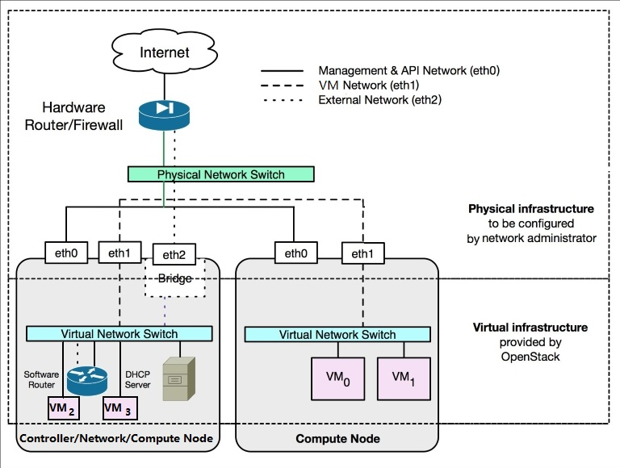
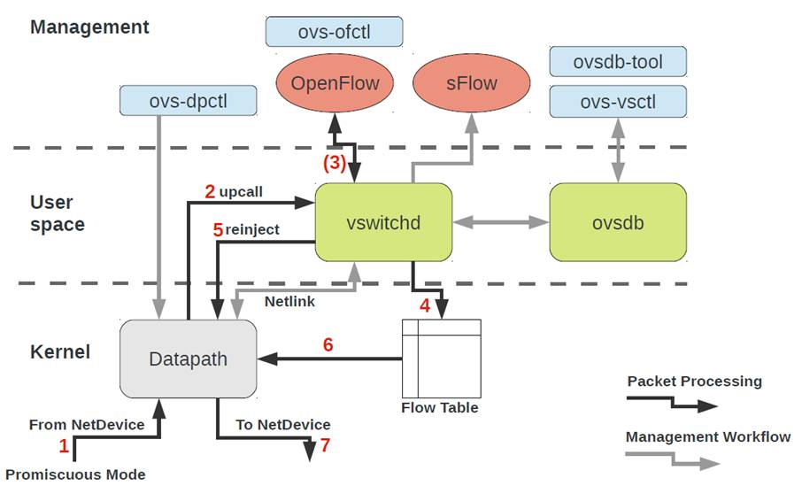
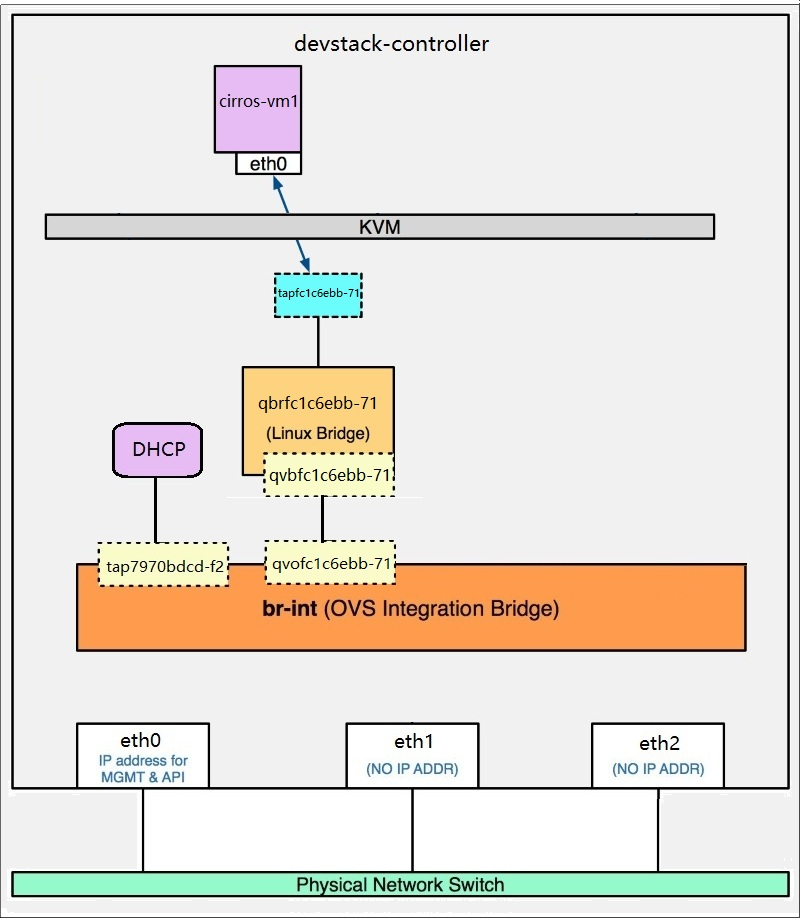
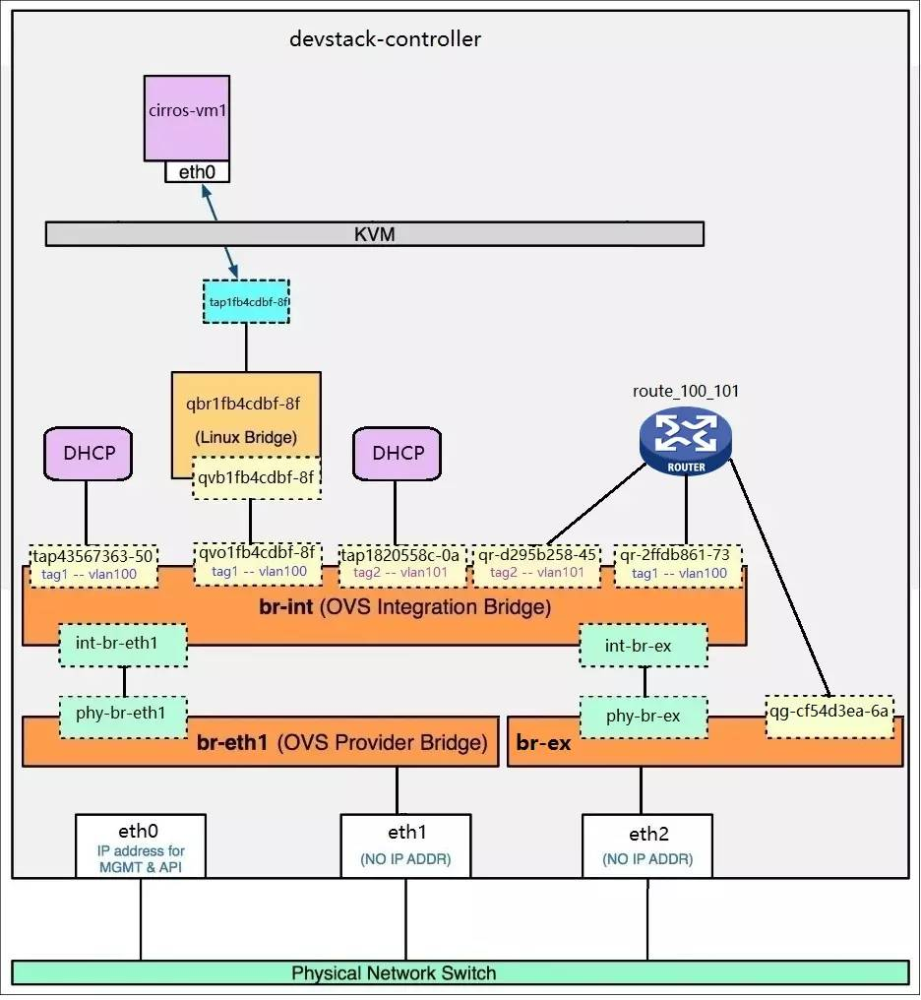
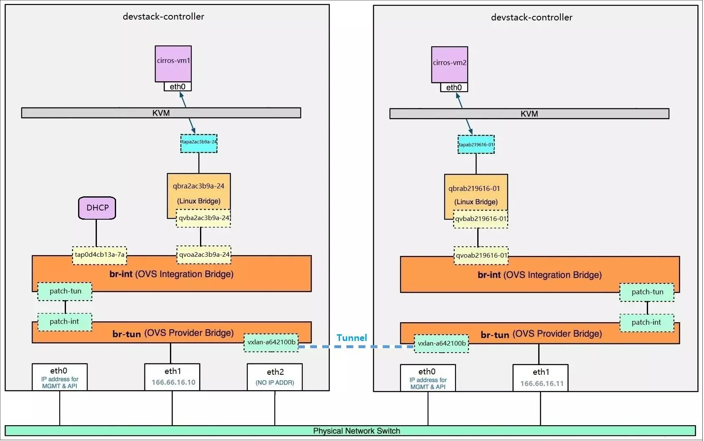

# 虚拟化

[部分内容](virtualization.md)

## 虚拟化类型

1型虚拟化：hypervisor直接安装在物理机上，实现方式是一个特殊的linux系统，对硬件虚拟化做了优化，性能比2型高

2型虚拟化：hypervisor安装在操作系统上，作为程序运行，可以嵌套

## kvm介绍

kvm基于linux内核实现，KVM有一个内核模块叫 kvm.ko，只用于管理虚拟 CPU 和内存。

那 IO 的虚拟化，比如存储和网络设备由谁实现呢？这个就交给 Linux 内核和Qemu来实现。

说白了，**作为一个 Hypervisor，KVM 本身只关注虚拟机调度和内存管理这两个方面。IO 外设的任务交给 Linux 内核和 Qemu。**

## libvirt

libvirt不仅是kvm管理工具，也可以管理virtualbox等hypervisor

Libvirt 包含 3 个东西：后台 daemon 程序 libvirtd、API 库和命令行工具 virsh

libvirtd是服务程序，接收和处理 API 请求；

API 库使得其他人可以开发基于 Libvirt 的高级工具，比如 virt-manager，这是个图形化的 KVM 管理工具，后面我们也会介绍；

virsh 是我们经常要用的 KVM 命令行工具，后面会有使用的示例。        

# neutron

[ref](https://www.xjimmy.com/openstack-5min)

## type mechanism

Neutron 支持的每一种网络类型都有一个对应的 ML2 type driver。type driver 负责维护网络类型的状态，执行验证，创建网络等。ML2 支持的网络类型包括 local, flat, vlan, vxlan 和 gre。

## type mechanism 例子

type driver 为 vlan，mechanism driver 为 linux bridge，我们要完成的操作是创建 network vlan100，那么：

vlan type driver 会确保将 vlan100 的信息保存到 Neutron 数据库中，包括 network 的名称，vlan ID 等。

linux bridge mechanism driver 会确保各节点上的 linux brige agent 在物理网卡上创建 ID 为 100 的 vlan 设备 和 brige 设备，并将两者进行桥接。

## switch

Neutron 支持多种虚拟交换机，包括 Linux 原生的 Linux Bridge 和 Open vSwitch。Open vSwitch（OVS）是一个开源的虚拟交换机，它支持标准的管理接口和协议。
利用 Linux Bridge 和 OVS，Neutron 除了可以创建传统的 VLAN 网络，还可以创建基于隧道技术的 Overlay 网络，比如 VxLAN 和 GRE（Linux Bridge 目前只支持 VxLAN）。

## router

Instance 可以配置不同网段的 IP，Neutron 的 router（虚拟路由器）实现 instance 跨网段通信。
router 通过 IP forwarding，iptables 等技术来实现路由和 NAT。

## load balancer

Openstack 在 Grizzly 版本第一次引入了 Load-Balancing-as-a-Service（LBaaS），提供了将负载分发到多个 instance 的能力。LBaaS 支持多种负载均衡产品和方案，不同的实现以 Plugin 的形式集成到 Neutron，目前默认的 Plugin 是 HAProxy。

## vlan vxlan gre

vlan
vlan 网络是具有 802.1q tagging 的网络。vlan 是一个二层的广播域，同一 vlan 中的 instance 可以通信，
不同 vlan 只能通过 router 通信。vlan 网络可以跨节点，是应用最广泛的网络类型。
vxlan
vxlan 是基于隧道技术的 overlay 网络。vxlan 网络通过唯一的 segmentation ID（也叫 VNI）与其他 vxlan 网络区分。
vxlan 中数据包会通过 VNI 封装成 UDP 包进行传输。
因为二层的包通过封装在三层传输，能够克服 vlan 和物理网络基础设施的限制。
gre
gre 是与 vxlan 类似的一种 overlay 网络。主要区别在于使用 IP 包而非 UDP 进行封装。

## flat network

https://www.cnblogs.com/horizonli/p/5172111.html

## 基本概念

下面总结了 Project，Network，Subnet，Port 和 VIF 之间关系。

VIF就是虚拟网卡，port是虚拟网桥端口，subnet是网段

Project  1 : m  Network  1 : m  Subnet  1 : m  Port  1 : 1  VIF  m : 1  Instance

## firewall securitygroup

Firewall 与 Security Group 的区别在于：

Firewall 安全策略位于 router，保护的是某个 project 的所有 network。        

Security Group 安全策略位于 instance，保护的是单个 instance。 

## network

Management 网络
用于节点之间 message queue 内部通信以及访问 database 服务，所有的节点都需要连接到 management 网络。

API 网络
OpenStack 各组件通过该网络向用户暴露 API 服务。Keystone, Nova, Neutron, Glance, Cinder, Horizon 的 endpoints 均配置在 API 网络上。

通常，管理员也通过 API 网络 SSH 管理各个节点。

VM 网络 
VM 网络也叫 tenant 网络，用于 instance 之间通信。 VM 网络可以选择的类型包括 local, flat, vlan, vxlan 和 gre。 VM 网络由 Neutron 配置和管理。

External网络
External 网络指的是 VM 网络之外的网络，该网络不由 Neutron 管理。 Neutron 可以将 router attach 到 External 网络，为 instance 提供访问外部网络的能力。 External 网络可能是企业的 intranet，也可能是 internet。

这几类网络只是逻辑上的划分，物理实现上有非常大的自由度。

我们可以为每种网络分配单独的网卡； 也可以多种网络共同使用一个网卡；为提高带宽和硬件冗余，可以使用 bonding 技术将多个物理网卡绑定成一个逻辑的网卡

## linux bridge

### linux bridge local

在 linux bridge 环境中，一个数据包从 instance 发送到物理网卡会经过下面几个类型的设备：

tap interface
命名为 tapN (N 为 0, 1, 2, 3……)。

linux bridge
命名为 brqXXXX。

vlan interface
命名为 ethX.Y（X 为 interface 的序号，Y 为 vlan id）。

vxlan interface
命名为 vxlan-Z（z 是 VNI）。

物理 interface
命名为 ethX（X 为 interface 的序号）。

vlan interface 会在 vlan 网络中使用；vxlan interface 会在 vxlan 网络中使用。

linux-bridge 支持 local, flat, vlan 和 vxlan 四种 network type，目前不支持 gre。

### linux bridge flat

如果需要创建多个 flat network，就得准备多个物理网卡，如下图所示

### linux bridge vlan

因为物理网卡 eth1 上面可以走多个 vlan 的数据，那么物理交换机上与 eth1 相连的的 port 要设置成 trunk 模式，而不是 access 模式。

### linux bridge router

### linux bridge external network

相当于存在一个nat
当数据包从 router 连接外网的接口 qg-b8b32a88-03 发出的时候，会做一次 Source NAT，即将包的源地址修改为 router 的接口地址 10.10.10.2，这样就能够保证目的端能够将应答的包发回给 router，然后再转发回源端 instance。

SNAT 让 instance 能够直接访问外网，但外网还不能直接访问 instance。因为 instance 没有（固定的）外网 IP。

可以通过浮动IP解决。这里的浮动IP指给router的出口接口分配外网IP，外网IP从设置的浮动IP池中获取，在router上进行一对一不涉及端口的nat，没有浮动IP得到的IP不固定（猜测）

### linux bridge vxlan

正如名字所描述的，VXLAN 提供与 VLAN 相同的以太网二层服务，但是拥有更强的扩展性和灵活性。
与 VLAN 相比，VXLAN 有下面几个优势：

支持更多的二层网段。 VLAN 使用 12-bit 标记 VLAN ID，最多支持 4094 个 VLAN，这对于大型云部署会成为瓶颈。
VXLAN 的 ID （VNI 或者 VNID）则用 24-bit 标记，支持 16777216 个二层网段。

能更好地利用已有的网络路径。 VLAN 使用 Spanning Tree Protocol 避免环路，这会导致有一半的网络路径被 block 掉。
VXLAN 的数据包是封装到 UDP 通过三层传输和转发的，可以使用所有的路径。

避免物理交换机 MAC 表耗尽。 由于采用隧道机制，TOR (Top on Rack) 交换机无需在 MAC 表中记录虚拟机的信息。

Host-A 向 Host-B 发送数据时，Host-B 的 MAC 和 IP 作为数据包的目标 MAC 和 IP，Host-A 的 MAC 作为数据包的源 MAC 和 IP，然后通过 VTEP-1 将数据发送出去。        

VTEP-1 从自己维护的映射表中找到 MAC-B 对应的 VTEP-2，然后执行 VXLAN 封装，加上 VXLAN
头，UDP 头，以及外层 IP 和 MAC 头。此时的外层 IP 头，目标地址为 VTEP-2 的 IP，源地址为 VTEP-1 的
IP。同时由于下一跳是 Router-1，所以外层 MAC 头中目标地址为 Router-1 的 MAC。        

数据包从 VTEP-1 发送出去后，外部网络的路由器会依据外层 IP 头进行包路由，最后到达与 VTEP-2 连接的路由器 Router-2。

Router-2将数据包发送给 VTEP-2。VTEP-2 负责解封数据包，依次去掉外层 MAC 头，外层 IP 头，UDP 头 和 VXLAN 头。        

VTEP-2 依据目标 MAC 地址将数据包发送给 Host-B。   

VTEP 可以由专有硬件来实现，也可以使用纯软件实现。
目前比较成熟的 VTEP 软件实现包括：

带 VXLAN 内核模块的 Linux        

Open vSwitch        

对于多 vxlan 之间的 routing 以及 floating ip，实现方式与 vlan 非常类似

#### L2 Population

L2 Population 是用来提高 VXLAN 网络 Scalability 的

L2 Population 的作用是在 VTEP 上提供 Porxy ARP 功能，使得 VTEP 能够预先获知 VXLAN 网络中如下信息：
1. VM IP — MAC 对应关系
2. VM — VTEP 的对应关系
   
L2 Population 生效后，创建的 vxlan-100 会多一个 Proxy ARP 功能
查看控制节点上的 forwarding database，可以看到 VTEP 保存了 cirros-vm2 的 port 信息
bridge fdb show dev vxlan-1

## 安全组 FWaaS

Neutron 为 instance 提供了两种管理网络安全的方法：安全组（Security Group）和虚拟防火墙。
安全组的原理是通过 iptables 对 instance 所在计算节点的网络流量进行过滤。
虚拟防火墙则由 Neutron Firewall as a Service（FWaaS）高级服务提供。其底层也是使用 **iptables**，在 Neutron Router 上对网络包进行过滤。

安全组的应用对象是虚拟网卡，由 L2 Agent 实现，比如 neutron_openvswitch_agent 和neutron_linuxbridge_agent。
安全组会在计算节点上通过 **iptables** 规则来控制进出 instance 虚拟网卡的流量。
也就是说：安全组保护的是 instance。

FWaaS 的应用对象是 router，可以在安全组之前控制外部过来的流量，但是对于同一个 subnet 内的流量不作限制。
也就是说：FWaaS 保护的是 subnet。

下面将 FWaaS 和安全组做个比较

相同点
1. 底层都是通过 iptables 实现。

不同点
1. FWaaS 的 iptables 规则应用在 router 上，保护整个租户网络；
安全组则应用在虚拟网卡上，保护单个 instance。

2. FWaaS 可以定义 allow 或者 deny 规则；安全组只能定义 allow 规则。

3. 目前 FWaaS 规则不能区分进出流量，对双向流量都起作用；
安全组规则可以区分 ingress 和 egress。

## LBaaS haproxy

## open vswitch

  br-ex  

    连接外部（external）网络的网桥

  br-int  

    集成（integration）网桥，所有 instance 的虚拟网卡和其他虚拟网络设备都将连接到该网桥。

  br-tun  

    隧道（tunnel）网桥，基于隧道技术的 VxLAN 和 GRE 网络将使用该网桥进行通信。

这些网桥都是 Neutron 自动为我们创建的，但是通过 brctl show 命令却看不到它们。 

这是因为我们使用的是 Open vSwitch 而非 Linux Bridge，需要用 Open vSwitch 的命令 ovs-vsctl show 查看

计算节点上也有 br-int 和 br-tun，但没有 br-ext。

在 Open vSwitch 环境中，一个数据包从 instance 发送到物理网卡大致会经过下面几个类型的设备

tap interface
命名为 tapXXXX。

linux bridge
命名为 qbrXXXX。

veth pair
命名为 qvbXXXX, qvoXXXX。

OVS integration bridge
命名为 br-int。

OVS patch ports
命名为 int-br-ethX 和 phy-br-ethX（X 为 interface 的序号）。

OVS provider bridge
命名为 br-ethX（X 为 interface 的序号）。

物理 interface
命名为 ethX（X 为 interface 的序号）。

OVS tunnel bridge
命名为 br-tun。

OVS provider bridge 会在 flat 和 vlan 网络中使用；OVS tunnel bridge 则会在 vxlan 和 gre 网络中使用。

### ovs-system

历史原因，Open vSwitch在内核中使用的是datapath，而每个datapath必须有一个端口与之对应，ovs使用的datapath名字是ovs-system，所以系统中就冒出来一个ovs-system的网卡，没有任何用途，忽略它既可。你也根本删不掉它的。

### openvswitch操作命令

ovs-vsctl add-br br0
ovs-vsctl add-port br0 eth0
ovs-vsctl add-port br0 tap0 tag=100

https://zhuanlan.zhihu.com/p/37408055

https://blog.csdn.net/ludongguoa/article/details/121122577

### local

Open vSwitch 目前还不支持将 iptables 规则放在与它直接相连的 tap 设备上。

如果做不到这一点，就无法实现 Security Group 功能。
为了支持 Security Group，不得不多引入一个 Linux Bridge 支持 iptables。

这样的后果就是网络结构更复杂了，路径上多了一个 linux bridge 和 一对 veth pair 设备。

ovs中不同local网络的主机无法ping通彼此，因为port上tag不同
Open vSwitch 的每个网桥都可以看作一个真正的交换机，可以支持 VLAN，这里的 tag 就是 VLAN ID。

br-int 中标记 tag 1 的 port 和 标记 tag 2 的 port 分别属于不同的 VLAN，它们之间是隔离的。

需要特别说明的是： Open vSwitch 中的 tag 是内部 VLAN，用于隔离网桥中的 port，与物理网络中的 VLAN 没有关系。（指与openstack网络vlan id无关，但确实是实现了vlan）

### flat

patch port 是 ovs bridge 自己特有的 port 类型，只能在 ovs 中使用。如果是连接两个 ovs bridge，优先使用 patch port，因为性能更好。所以：

1. 连接两个 ovs bridge，优先使用 patch port。技术上veth pair 也能实现，但性能不如 patch port。
2. 连接 ovs bridge 和 linux bridge，只能使用 veth pair。
3. 连接两个 linux bridge，只能使用 veth pair。

### vlan

与 Linux Bridge driver 不同，Open vSwitch driver 并不通过 eth1.100, eth1.101 等 VLAN interface 来隔离不同的 VLAN。

所有的 instance 都连接到同一个网桥 br-int，Open vSwitch 通过 flow rule（流规则）来指定如何对进出 br-int 的数据进行转发，进而实现 vlan 之间的隔离。

具体来说：当数据进出 br-int 时，flow rule 可以修改、添加或者剥掉数据包的 VLAN tag，Neutron 负责创建这些 flow rule 并将它们配置到 br-int，br-eth1 等 Open vSwitch 上。

查看 flow rule 的命令是 `ovs-ofctl dump-flows [bridge]`
可以通过命令 `ovs-ofctl show [bridge]` 查看 port 编号
具体flow table原理见原教程

### vxlan

