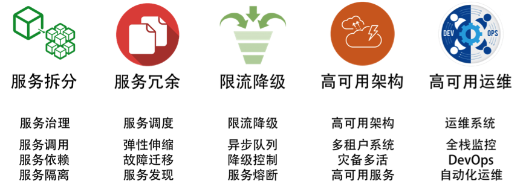

- [左耳听风](#左耳听风)
  - [思考](#思考)
  - [promise模式](#promise模式)
    - [js](#js)
    - [go](#go)
  - [时间管理](#时间管理)
  - [故障](#故障)
  - [git](#git)
    - [中心式协同工作流](#中心式协同工作流)
    - [功能分支协同工作流](#功能分支协同工作流)
    - [GitFlow 协同工作流](#gitflow-协同工作流)
    - [GitHub Flow](#github-flow)
    - [GitLab Flow](#gitlab-flow)
  - [分布式](#分布式)
  - [编程范式](#编程范式)
    - [泛型](#泛型)
    - [函数式编程](#函数式编程)

# 左耳听风

## 思考 

我完全没有必要通过打工听人安排而活着，而是反过来通过在公司工作提高自己的技能，让自己可以更为`独立`和自由地生活。
我就可以有更多的时间，去研究公司内外那些更为核心更有技术含量的技术了

这件事儿让我在入行的时候就明白了一些道理。
要去经历大多数人经历不到的，要把学习时间花在那些比较`难`的地方。
要写文章就要写没有人写过的，或是别人写过，但我能写得更好的。
更重要的是，技术和知识完全是可以变现的。

第一个故事，发生在 2001 年到 2002 年期间，那时我还是一个外包程序员，有`一整年`被当成劳动力外包进了某银行做软件开发，从早上 9 点工作到晚上 10 点，每周要从周一工作到周六。这么忙，但是我坚持每天晚上看半个小时到一个小时的书，看得不多，一天 2-3 页。一年后，我看完了两本经典书，一本是《TCP/IP 详解：卷 I》，另一本是《UNIX 环境高级编程》。

## promise模式

### js

用于异步编程

```js
doSomething(function(result) {
  doSomethingElse(result, function(newResult) {
    doThirdThing(newResult, function(finalResult) {
      console.log('Got the final result: ' + finalResult);
    }, failureCallback);
  }, failureCallback);
}, failureCallback);
```

```js
doSomething()
.then(result => doSomethingElse(result))
.then(newResult => doThirdThing(newResult))
.then(finalResult => {
  console.log(`Got the final result: ${finalResult}`);
}).catch(failureCallback);

function doSomething() {
  let promise = new Promise();
  let xhr = new XMLHttpRequest();
  xhr.open('GET', 'http://coolshell.cn/....', true);

  xhr.onload = function (e) {
        if (this.status === 200) {
            results = JSON.parse(this.responseText);
            promise.resolve(results); //成功时，调用resolve()方法
        }
    };

    xhr.onerror = function (e) {
        promise.reject(e); //失败时，调用reject()方法
    };

    xhr.send();
    return promise;
}
```
从上面的代码示例中，我们可以看到，如果成功了，要调用`Promise.resolve()` 方法，这样 Promise 对象会继续调用下一个 then()。如果出错了就调用 `Promise.reject()` 方法，这样就会忽略后面的 then() 直到 catch() 方法。

在 ECMAScript 2017 的标准中，我们可以使用`async/await`这两个关键字来取代 Promise 对象，这样可以让我们的代码更易读。

```js

async function foo() {
  try {
    let result = await doSomething();
    let newResult = await doSomethingElse(result);
    let finalResult = await doThirdThing(newResult);
    console.log(`Got the final result: ${finalResult}`);
  } catch(error) {
    failureCallback(error);
  }
}
```

如果在函数定义之前使用了 async 关键字，就可以在函数内使用 await。 当在 await 某个 Promise 时，函数暂停执行，直至该  Promise 产生结果，并且暂停不会阻塞主线程。 如果 Promise resolve，则会返回值。 如果 Promise reject，则会抛出拒绝的值。

### go

```go

type Promise struct {
  wg  sync.WaitGroup
  res string
  err error
}

func NewPromise(f func() (string, error)) *Promise {
  p := &Promise{}
  p.wg.Add(1)
  go func() {
    p.res, p.err = f()
    p.wg.Done()
  }()
  return p
}

func (p *Promise) Then(r func(string), e func(error)) (*Promise){
  go func() {
    p.wg.Wait()
    if p.err != nil {
      e(p.err)
      return 
    }
    r(p.res)
  }()
  return p
}


func exampleTicker() (string, error) {
  for i := 0; i < 3; i++ {
    fmt.Println(i)
    <-time.Tick(time.Second * 1)
  }
  
  rand.Seed(time.Now().UTC().UnixNano())
  r:=rand.Intn(100)%2
  fmt.Println(r)
  if  r != 0 {
    return "hello, world", nil
  } else {
    return "", fmt.Errorf("error")
  }
}

func main() {
  doneChan := make(chan int)
  
  var p = NewPromise(exampleTicker)
  p.Then(func(result string) { fmt.Println(result); doneChan <- 1 }, 
      func(err error) { fmt.Println(err); doneChan <-1 })
      
  <-doneChan
}
```

## 时间管理

让自己专注在工作上，不要被频繁打断，要`主动`的要求，而不是被动的接受

对不科学的急于求成导致的加班说“不”，但最好`不要说不`，而是

当你面对`做不到`的需求时，你不要说这个需求做不到。尤其是，你不要马上说做不到，你要先想一下，这样让别人觉得你是想做的，但是，在认真思考过后，你觉得做不到，并且给出一个你觉得能做到的方案。这里的诀窍是——给出另一个你`可以做到的方案`，而不是把对方的方案直接回绝掉。

当你面对`过于复杂`的需求时，你不要说不。你要反问一下，为什么要这样做？这样做的目的是什么？当了解完目的以后，你可以给出一个自己的方案，或是和对方讨论一个性价比更好的方案。你可以回复说，这个需求好复杂，我们能不能先干这个，再做那个，这样会更经济一些。这里的诀窍是——我不说我不能完全满足你，但我说我可以`部分满足`你。

当你面对`时间完全不够`的需求时，你也不要说不。既然对方把压力给你，你要想办法把这个`压力`还回去，或是让对方来和你一同分担这个压力。这个时候，我惯用的方式是给回三个选择：a. 我可以加班加点完成，但是我不保证好的质量，有 bug 你得认，而且事后你要给我 1 个月的时间还债。b. 我可以加班加点，还能保证质量，但我没办法完成这么多需求，能不能减少一些？c. 我可以保质保量地完成所有的需求，但是，能不能多给我 2 周时间？

这里的诀窍是——我不能说不，但是我要有条件地说是。而且，我要把你给我的压力再反过来还给你，看似我给了需求方选择，实际上，我掌握了主动。

国内的公司和国外公司还有一个很不同的事情，就是`大量的加班和大量冗长的会议`。我见过很多国内的公司，无论大公司还是小的创业公司，都是这个样子的。老实说，我对这个事情也能理解也不能理解。
一方面，我能理解为什么会有这么多的加班和会议，主要原因还是管理者在管理上只会使用低级的通过`劳动密集型`的方式来做事。
另一方面，我不能理解的是，国外公司的加班和会议长度根本不像国内的公司，人家做得也比中国的公司好得多。在国内的公司，老板们看到团队在拼命加班，会很高兴，而在国外的公司，老板看到团队在拼命加班，会觉得这个团队一定是哪里出了问题，老板会比较焦虑。

对于加班的事，除了像上面说的那样，学会如何说“不”外，我发现很多时候造成加班的原因就是`恶性循环`。也就是说，因为加班干出来了质量不好的软件，于是线上故障很多，要花时间处理，而后面的需求也过来了，发现复杂代码的扩展性很差，越干越慢，越干越烂，越干故障越多。于是，你会被抱怨得越来越多。

对于开会，我觉得今天大多数的会都开错了。在会上抛出问题，还是开放性的问题，然后公说公有理，婆说婆有理，任大家自由发挥，各种跑题跑偏，最后还没有任何的答案。开会，不是讨论问题，而是`讨论方案`，开会不是要有议题，而是要有议案。

## 故障

在`亚马逊`内部，每个开发团队至少都会有一位 `oncall` 的工程师。在 oncall 的时候，工程师要专心处理线上故障，轮换周期为每人一周。一旦发生比较大的故障，比如，S1 全部不可用，或 S2 某功能不可用，而且找不到替代方案，那么这个故障就会被提交到一个工单系统里。几乎所有相关团队 oncall 的工程师都会被叫到线上处理问题。

大家都知道，在亚马逊，不是按技能分工，而是按`职责分工`，也就是一个团队不是按前端、后端、运维等来分工，而是按所负责的 Service 来分工。所以，亚马逊的开发人员都是前端、后端、测试、运维全部都要干的。而亚马逊内部有很多的服务，一旦出现问题，为了避免一个工单在各个团队流转，需要所有团队上线处理，这样是最快的。

所以，我们需要做一些故障前的准备工作。

在这里，我给出一些我的经验。以用户功能为索引的服务和资源的`全视图`。首先，我们需要一个系统来记录前端用户操作界面和后端服务，以及服务使用到的硬件资源之间的关联关系。这个系统有点像 CMDB（配置管理数据库），但是比 CMDB 要大得多，是以用户端的功能来做索引的。然后，把后端的服务、服务的调用关系，以及服务使用到的资源都关联起来做成一个视图。

这个视图最好是由相应的`自动化监控系统`生成。有了这个资源图后，我们就可以很容易地找到处理故障的路径了。这就好像一张地图，如果没有地图，我们只能像个无头苍蝇一样乱试了。

为地图中的各个服务`制定关键指标，以及一套运维流程和工具，包括应急方案`。以用户功能为索引，为每个用户功能的服务都制定一个服务故障的检测、处理和恢复手册，以及相关的检测、查错或是恢复的运维工具。对于基础层和一些通用的中间件，也需要有相应的最佳实践的方法。比如 Redis，怎样检查其是否存在问题，怎样查看其健康和运行状态？哪些是关键指标，面对常见的故障应该怎么应对，服务不可用的处理方案是什么，服务需要回滚了应该怎么操作，等等。这就好像一个导航仪，能够告诉你怎么做。而没有导航仪，就没有章法，会导致混乱。

设定故障的`等级`。还要设定不同故障等级的处理方式。比如，亚马逊一般将故障分为 4 级：1 级是全站不可用；2 级是某功能不可用，且无替代方案；3 级是某功能不可用，但有替代方案；4 级是非功能性故障，或是用户不关心的故障。阿里内的分类更多样一些，有时会根据影响多少用户来定故障等级。制定故障等级，主要是为了确定该故障要牵扯进多大规模的人员来处理。故障级别越高，牵扯进来的人就越多，参与进来的管理层级别也就越高。就像亚马逊的全员上线 oncall 一样。这就好像是我们社会中常用的“红色警报”、“橙色警报”、“黄色警报”之类的，会触发不同的处理流程。

`故障演练`。故障是需要演练的。因为故障并不会时常发生，但我们又需要不断提升处理故障的能力，所以需要经常演练。一些大公司，如 Netflix，会有一个叫 Chaos Monkey 的东西，随机地在生产线上乱来。Facebook 也会有一些故障演习，比如，随机关掉线上的一些服务器。总之，要提升故障处理水平，最好的方式就是实践。见得多了，处理得多了，才能驾轻就熟。故障演练是一个非常好的实践。

`灰度发布系统`。要减少线上故障的影响范围，通过灰度发布系统来发布是一个很不错的方式。毕竟，我们在测试环境中很难模拟出线上环境的所有情况，所以，在生产线上进行灰度发布或是 A/B 测试是一件很好的事。

`故障复盘`
故障处理的整个过程。就像一个 log 一样，需要详细地记录几点几分干了什么事，把故障从发生到解决的所有细节过程都记录下来。
故障原因分析。需要说明故障的原因和分析报告。
Ask 5 Whys。需要反思并反问至少 5 个为什么，并为这些“为什么”找到答案。
故障后续整改计划。需要针对上述的“Ask 5 Whys”说明后续如何举一反三地从根本上解决所有的问题。

老实说，我对`惩罚`故障责任人的方式非常`不认同`。
首先，惩罚故障责任人对于解决故障完全没有任何帮助。因为它们之间没有因果关系，既不是充分条件，也不是必要条件，更不是充要条件。这是逻辑上的错误。
其次，做得越多，错得越多。如果不想出错，最好什么也不要做。所以，惩罚故障责任人只会让大家都很保守，也会让大家都学会保守，而且开始推诿，营造一种恐怖的气氛。

>我记得devops手册上也说到，惩罚会导致恐惧感，对问题的隐瞒不报，应该共同承担责任，共同推动制度进步

## git

### 中心式协同工作流

首先，我们先说明一下，Git 是可以像 SVN 这样的中心工作流一样工作的。我相信很多程序员都是在采用这样的工作方式。

这个过程一般是下面这个样子的。
从服务器上做`git pull origin master`把代码同步下来。改完后，`git commit`到本地仓库中。然后`git push origin master`到远程仓库中，这样其他同学就可以得到你的代码了。

如果在第 3 步发现 push 失败，因为别人已经提交了，那么你需要先把服务器上的代码给 pull 下来，为了避免有 merge 动作，你可以使用 `git pull --rebase` 。这样就可以把服务器上的提交直接合并到你的代码中，对此，Git 的操作是这样的。先把你本地提交的代码放到一边。然后把服务器上的改动下载下来。然后在本地把你之前的改动再重新一个一个地做 commit，直到全部成功。

如果有冲突，那么你要先解决冲突，然后做 `git rebase --continue` 。

### 功能分支协同工作流

上面的那种方式有一个问题，就是大家都在一个`主干`上开发程序，对于小团队或是小项目你可以这么干，但是对比较大的项目或是人比较多的团队，这么干就会有很多问题。最大的问题就是代码可能干扰太严重。尤其是，我们想安安静静地开发一个功能时，我们想把各个功能的代码变动隔离开来，同时各个功能又会有多个开发人员在开发。

因此，我们引入“功能分支”。这个协同工作流的开发过程如下。
首先使用 `git checkout -b new-feature` 创建 “new-feature”分支。
然后共同开发这个功能的程序员就在这个分支上工作，进行 add、commit 等操作。
然后通过 `git push -u origin new-feature` 把分支代码 push 到服务器上。
其他程序员可以通过`git pull --rebase`来拿到最新的这个分支的代码。
最后通过 `Pull Request` 的方式做完 Code Review 后合并到 Master 分支上。

另外，我想提醒一下，为什么会叫“功能分支”，而不是“项目分支”？因为 Git 的最佳实践希望大家在开发的过程中，快速提交，快速合并，快速完成。这样可以少很多冲突的事，所以叫功能分支。

### GitFlow 协同工作流

整个代码库中一共有五种分支。

Master 分支。也就是主干分支，用作发布环境，上面的每一次提交都是可以发布的。

Feature 分支。也就是功能分支，用于开发功能，其对应的是开发环境。

Developer 分支。是开发分支，一旦功能开发完成，就向 Developer 分支合并，合并完成后，删除功能分支。这个分支对应的是集成测试环境。

Release 分支。当 Developer 分支测试达到可以发布状态时，开出一个 Release 分支来，然后做发布前的准备工作。这个分支对应的是预发环境。
之所以需要这个 Release 分支，是我们的开发可以继续向前，不会因为要发布而被 block 住而不能提交。
一旦 Release 分支上的代码达到可以上线的状态，那么需要把 Release 分支向 Master 分支和 Developer 分支同时合并，以保证代码的一致性。然后再把 Release 分支删除掉。

Hotfix 分支。是用于处理生产线上代码的 Bug-fix，每个线上代码的 Bug-fix 都需要开一个 Hotfix 分支，完成后，向 Developer 分支和 Master 分支上合并。合并完成后，删除 Hotfix 分支。

### GitHub Flow

所谓 GitHub Flow，其实也叫 Forking flow，也就是 GitHub 上的那个开发方式。

每个开发人员都把“官方库”的代码 fork 到自己的代码仓库中。
然后，开发人员在自己的代码仓库中做开发，想干啥干啥。
因此，开发人员的代码库中，需要配两个远程仓库，一个是自己的库，一个是官方库（用户的库用于提交代码改动，官方库用于同步代码）。
然后在本地建“功能分支”，在这个分支上做代码开发。
这个功能分支被 push 到开发人员自己的代码仓库中。
然后，向“官方库”发起 pull request，并做 Code Review。一旦通过，就向官方库进行合并。
这就是 GitHub 的工作流程。

如果你有“官方库”的权限，那么就可以直接在“官方库”中建功能分支开发，然后提交 pull request。通过 Code Review 后，合并进 Master 分支，而 Master 一旦有代码被合并就可以马上 release。

### GitLab Flow

在github上改进

## 分布式

通常来说，我们可以把系统分成四层：基础层、平台层、应用层和接入层。

`基础层`就是我们的机器、网络和存储设备等。

`平台层`就是我们的中间件层，Tomcat、MySQL、Redis、Kafka 之类的软件。

`应用层`就是我们的业务软件，比如，各种功能的服务。

`接入层`就是接入用户请求的网关、负载均衡或是 CDN、DNS 这样的东西。

对于这四层，我们需要知道：任何一层的问题都会导致整体的问题；没有统一的视图和管理，导致运维被割裂开来，造成更大的复杂度。


提高系统性能的常用技术

`缓存系统`。加入缓存系统，可以有效地提高系统的访问能力。从前端的浏览器，到网络，再到后端的服务，底层的数据库、文件系统、硬盘和 CPU，全都有缓存，这是提高快速访问能力最有效的手段。对于分布式系统下的缓存系统，需要的是一个缓存集群。这其中需要一个 Proxy 来做缓存的分片和路由。

`负载均衡系统`。负载均衡系统是水平扩展的关键技术，它可以使用多台机器来共同分担一部分流量请求。

`异步调用`。异步系统主要通过消息队列来对请求做排队处理，这样可以把前端的请求的峰值给“削平”了，而后端通过自己能够处理的速度来处理请求。这样可以增加系统的吞吐量，但是实时性就差很多了。同时，还会引入消息丢失的问题，所以要对消息做持久化，这会造成“有状态”的结点，从而增加了服务调度的难度。

`数据分区和数据镜像`。数据分区是把数据按一定的方式分成多个区（比如通过地理位置），不同的数据区来分担不同区的流量。这需要一个数据路由的中间件，会导致跨库的 Join 和跨库的事务非常复杂。而数据镜像是把一个数据库镜像成多份一样的数据，这样就不需要数据路由的中间件了。你可以在任意结点上进行读写，内部会自行同步数据。然而，数据镜像中最大的问题就是数据的一致性问题。

对于一般公司来说，在初期，会使用读写分离的数据镜像方式，而后期会采用分库分表的方式。



提高系统系统稳定性的一些常用技术

`服务拆分`。服务拆分主要有两个目的：一是为了隔离故障，二是为了重用服务模块。但服务拆分完之后，会引入服务调用间的依赖问题。

`服务冗余`。服务冗余是为了去除单点故障，并可以支持服务的弹性伸缩，以及故障迁移。然而，对于一些有状态的服务来说，冗余这些有状态的服务带来了更高的复杂性。其中一个是弹性伸缩时，需要考虑数据的复制或是重新分片，迁移的时候还要迁移数据到其它机器上。

`限流降级`。当系统实在扛不住压力时，只能通过限流或者功能降级的方式来停掉一部分服务，或是拒绝一部分用户，以确保整个架构不会挂掉。这些技术属于保护措施。

`高可用架构`。通常来说高可用架构是从冗余架构的角度来保障可用性。比如，多租户隔离，灾备多活，或是数据可以在其中复制保持一致性的集群。总之，就是为了不出单点故障。

`高可用运维`。高可用运维指的是 DevOps 中的 CI/CD（持续集成 / 持续部署）。一个良好的运维应该是一条很流畅的软件发布管线，其中做了足够的自动化测试，还可以做相应的灰度发布，以及对线上系统的自动化控制。这样，可以做到“计划内”或是“非计划内”的宕机事件的时长最短。

## 编程范式

### 泛型

C 语言是如何实现泛型的。C 语言的类型泛型基本上来说就是使用`void *关键字`或是使用`宏定义`。

下面是一个使用了void*泛型版本的 swap 函数。
```c
void swap(void* x, void* y, size_t size){     
  char tmp[size];     
  memcpy(tmp, y, size);     
  memcpy(y, x, size);     
  memcpy(x, tmp, size);
}
```

上面这个函数几乎完全改变了 int 版的函数的实现方式，这个实现方式有三个重点：

函数接口中增加了一个`size参数`。为什么要这么干呢？因为，用了 void* 后，类型被“抽象”掉了，编译器不能通过类型得到类型的尺寸了，所以，需要我们手动地加上一个类型长度的标识。

函数的实现中使用了`memcpy()函数`。为什么要这样干呢？还是因为类型被“抽象”掉了，所以不能用赋值表达式了，很有可能传进来的参数类型还是一个结构体，因此，为了要交换这些复杂类型的值，我们只能使用内存复制的方法了。

函数的实现中使用了一个`temp[size]数组`。这就是交换数据时需要用的 buffer，用 buffer 来做临时的空间存储。

于是，新增的size参数，使用的memcpy内存拷贝以及一个 buffer，这增加了编程的`复杂度`。这就是 C 语言的类型抽象所带来的复杂度的提升。

在提升复杂度的同时，我们发现还有问题，比如，我们想交换两个字符串数组，类型是char*，那么，我的swap()函数的x和y参数是不是要用void**了？这样一来，接口就没法定义了。

除了使用 void* 来做泛型，在 C 语言中，还可以用宏定义来做泛型，如下所示：
```c
#define swap(x, y, size) {\  
char temp[size]; \  
memcpy(temp, &y, size); \  
memcpy(&y,   &x, size); \  
memcpy(&x, temp, size); \
}
```
但用宏带来的问题就是编译器做`字符串替换`，因为宏是做字符串替换，所以会导致代码膨胀，导致编译出的执行文件比较大。不过对于 swap 这个简单的函数来说，用void*和宏替换来说都可以达到泛型。

### 函数式编程

对于`函数式编程`来说，它只关心定义输入数据和输出数据相关的关系，数学表达式里面其实是在做一种映射（mapping），输入的数据和输出的数据关系是什么样的，是用函数来定义的。

```python
def inc(x):
    def incx(y):
        return x+y
    return incx
 
inc2 = inc(2)
inc5 = inc(5)
 
print inc2(5) # 输出 7
print inc5(5) # 输出 10
```
上面这段 Python 的代码，开始有点复杂了。我们可以看到上面那个例子inc()函数返回了另一个函数incx()，于是可以用inc()函数来构造各种版本的 inc 函数，比如：inc2()和inc5()。这个技术其实就是上面所说的 `currying` 技术。

从这个技术上，你可能体会到函数式编程的理念。`把函数当成变量`来用，关注描述问题而不是怎么实现，这样可以让代码更易读。因为函数返回里面的这个函数，所以函数关注的是表达式，关注的是`描述这个问题`，而不是怎么实现这个事情。

函数式编程关注的是：describe what to do, rather than how to do it。于是，我们把以前的过程式编程范式叫做 Imperative Programming – `指令式编程`，而把函数式编程范式叫做 Declarative Programming – `声明式编程`。

